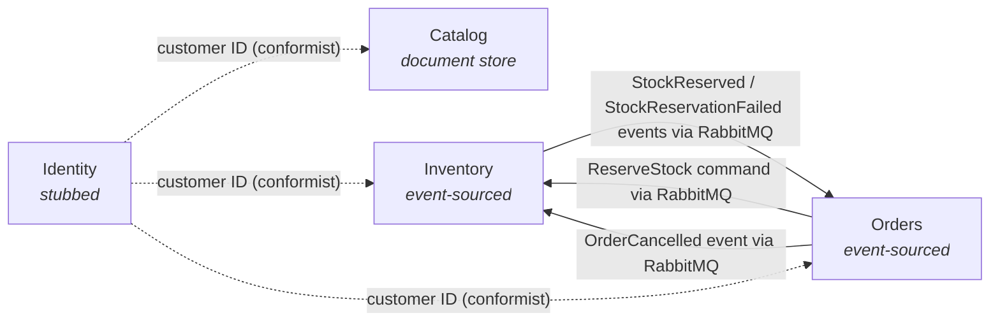

# CritterMart — Context Map

This document is the integration backdrop for CritterMart's bounded contexts. It names each context's deployment status and persistence shape, draws the integration topology, and uses DDD strategic-design vocabulary to label the relationships between contexts. The Event Modeling workshop and later slice work reference this map when answering cross-BC questions.

For *what* each bounded context is about, see [`docs/vision.md`](../vision.md). For the deployment-shape rationale, see [ADR 001](../decisions/001-separate-services-topology.md), [ADR 003](../decisions/003-wolverine-rabbitmq-transport.md), [ADR 006](../decisions/006-wolverine-http-per-service-no-bff.md), and [ADR 009](../decisions/009-polecat-deferred-for-round-one.md).

## Bounded contexts

- **Catalog** — deployed service, document store. Hosts products, prices, and descriptions; the "when CRUD is fine" example.
- **Inventory** — deployed service, event-sourced. Tracks stock per SKU; the textbook event-sourcing case.
- **Orders** — deployed service, event-sourced. Contains the Cart and Order aggregates; Order is the process manager for fulfilling a purchase (see [ADR 007](../decisions/007-process-manager-via-handlers-for-order.md)).
- **Identity** — stubbed for round one (see [ADR 009](../decisions/009-polecat-deferred-for-round-one.md)). A customer ID is hardcoded into the frontend; no deployed service.

## Topology

Solid edges are active round-one integrations over RabbitMQ. Dashed edges are conformist relationships with no active integration: all three deployed services accept the customer-ID shape from the stubbed Identity model.

## Integration relationships

| Pair | Pattern | Upstream | Messages | Notes |
| --- | --- | --- | --- | --- |
| Orders ↔ Inventory | Customer-Supplier | Inventory | `ReserveStock` command from Orders; `StockReserved` and `StockReservationFailed` events back to Orders; `OrderCancelled` event from Orders to Inventory to release the reservation | Bidirectional event flow over RabbitMQ. Orders is the customer; Inventory is the supplier whose capacity gates fulfillment. |
| Identity → Catalog, Inventory, Orders | Conformist | Identity | None (no traffic in round one) | Identity is stubbed. The three deployed services accept a customer ID from the hardcoded model without translation. A conceptual relationship only; no active wire integration. |

**Catalog has no BC-level integration with the other services in round one.** Product information flows through the frontend, which reads Catalog over HTTP and passes the relevant product fields into Cart commands. The Cart aggregate snapshots that product data at add-to-cart time. This is presentation-layer composition, not a bounded-context integration, and the talk acknowledges the distinction.

## Round-one stubs and deferrals

- **No synchronous service-to-service HTTP.** Per ADR 001 and ADR 003, cross-service traffic is brokered messaging only.
- **Identity stubbed.** Per ADR 009, no deployed Identity service; customer ID is hardcoded into the frontend.
- **No Payments service.** Payment authorization is stubbed inside the Orders service; see [ADR 007](../decisions/007-process-manager-via-handlers-for-order.md) for how Orders models the payment timeout as a self-scheduled message.
- **No Returns BC, no Promotions BC, no marketplace listings, no vendor BC.** Out of scope per [`docs/vision.md`](../vision.md)'s deliberate non-goals.

## Long road

Relationships that would appear in future rounds and the DDD patterns they would likely take:

- **A real Identity service via Polecat.** Conformist becomes Customer-Supplier; the customer-ID shape gains a contract owner and a real upstream lifecycle.
- **A Returns BC.** Likely Customer-Supplier with both Orders (for the originating purchase) and Inventory (for restocking); an Anti-Corruption Layer is plausible if the Returns model diverges from Orders' line-item shape.
- **Promotions with DCB-protected coupon redemption.** Published-Language for the coupon definitions Orders consumes at checkout.
- **Catalog publishing `ProductPriceChanged` events.** Orders subscribes for repricing in-flight carts; Published-Language for the price-change event shape.
