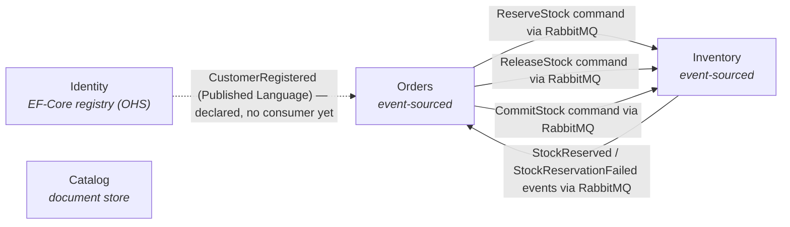

# CritterMart — Context Map

This document is the integration backdrop for CritterMart's bounded contexts. It names each context's deployment status and persistence shape, draws the integration topology, and uses DDD strategic-design vocabulary to label the relationships between contexts. The Event Modeling workshop and later slice work reference this map when answering cross-BC questions.

For *what* each bounded context is about, see [`docs/vision.md`](../vision.md). For the deployment-shape rationale, see [ADR 001](../decisions/001-separate-services-topology.md), [ADR 003](../decisions/003-wolverine-rabbitmq-transport.md), [ADR 006](../decisions/006-wolverine-http-per-service-no-bff.md), [ADR 009](../decisions/009-polecat-deferred-for-round-one.md), and [ADR 023](../decisions/023-real-authentication-for-identity.md).

## Bounded contexts

- **Catalog** — deployed service, document store. Hosts products, prices, and descriptions; the "when CRUD is fine" example.
- **Inventory** — deployed service, event-sourced. Tracks stock per SKU; the textbook event-sourcing case.
- **Orders** — deployed service, event-sourced. Contains the Cart and Order aggregates; Order is the process manager for fulfilling a purchase (see [ADR 007](../decisions/007-process-manager-via-handlers-for-order.md)).
- **Identity** — **promoted** from round-one stub to a kept EF-Core **customer registry** — the one non-event-sourced BC (current-state rows, not events). **Open-Host Service** (`GET /customers/{id}`, storefront-facing) + **Published Language** (`CustomerRegistered`). Spike-realized on `spike/efcore-identity` (slices 5.1/5.2); code lands on `main` via the per-slice chain. See [Workshop 002](../workshops/002-identity-event-model.md). **Auth: decided, not yet built.** [ADR 023](../decisions/023-real-authentication-for-identity.md) closes the auth stub — Identity gains real authentication via **ASP.NET Core Identity** (relational user store, still no event sourcing — this *extends* the boring-CRUD foil, not reverses it) and becomes the **auth issuer**: it mints a self-validated, asymmetrically-signed **JWT** that the other three services verify **offline** against a config-distributed public key. Until the auth slices (§§ 5.8–5.11) ship, the `X-Customer-Id` seam still carries identity; once they do, the JWT's `sub` claim replaces it.

## Topology

Solid edges are active round-one integrations over RabbitMQ. The dashed edge is Identity's **Published Language** (`CustomerRegistered`): declared by the promotion but with no consumer yet — the spike publishes it to RabbitMQ unconsumed. Identity also exposes an **Open-Host Service** read API (`GET /customers/{id}`) for the storefront; that is not drawn because it is frontend-facing HTTP (like Catalog's product reads), not a cross-BC edge.

**Auth adds no new edge — that is the point.** ADR 023's JWT trust ([Workshop 002](../workshops/002-identity-event-model.md) §§ 5.8–5.11) does *not* draw an Identity→{Catalog,Inventory,Orders} arrow: each resource server validates the token **offline** against Identity's public key, distributed as **configuration**. There is no per-request or startup HTTP into Identity (the public key is config, not a fetched JWKS document), so the strongest possible reading of the no-sync-HTTP non-negotiable holds. The SPA carries the JWT to all four services as `Authorization: Bearer …` — that is browser→service HTTP, like every other storefront call, not a cross-BC edge. Identity's role as **auth issuer** is a published contract (JWT claim shape + public key), not a runtime integration.

## Integration relationships

| Pair | Pattern | Upstream | Messages | Notes |
| --- | --- | --- | --- | --- |
| Orders ↔ Inventory | Customer-Supplier | Inventory | `ReserveStock` command from Orders; `StockReserved` and `StockReservationFailed` events back to Orders; `ReleaseStock` command from Orders on cancellation; `CommitStock` command from Orders on confirmation | Bidirectional flow over RabbitMQ. Orders is the customer; Inventory is the supplier whose capacity gates fulfillment. Every terminal order state has an Inventory consequence: confirm → `CommitStock`, cancel → `ReleaseStock`. |
| Identity → Orders (and future consumers) | Open-Host Service + Published Language | Identity | `CustomerRegistered` (Published-Language event, via the EF-Core outbox → RabbitMQ); `GET /customers/{id}` (Open-Host Service, storefront-facing) | Kept EF-Core registry ([Workshop 002](../workshops/002-identity-event-model.md)). Identity publishes a stable customer contract; consumers subscribe rather than negotiate. **Declared now, no active traffic yet** — the spike publishes `CustomerRegistered` unconsumed. Cross-BC consumers resolve customer data from a LOCAL read model fed by the PL event (slice 5.4), never a sync call into Identity (ADR 001 forbids sync service-to-service HTTP); the OHS read API is for the storefront, like Catalog's product reads. |
| Identity → Catalog / Inventory / Orders (auth) | Open-Host Service + Published Language, consumers Conformist | Identity | The **JWT claim contract** (`sub` = customer id, plus issuer/audience/lifetime) and Identity's **public key** — a published contract, not a message on any edge ([ADR 023](../decisions/023-real-authentication-for-identity.md)) | **Decided (ADR 023), not yet built** ([Workshop 002](../workshops/002-identity-event-model.md) §§ 5.8–5.11). Identity is the sole **auth issuer** (holds the private key, mints the token); the three resource servers are **Conformist** — they accept and verify `sub` without translation, exactly as they already accept the `X-Customer-Id` shape. Verification is **offline** against the config-distributed public key, so this relationship adds **no runtime integration edge** and no sync HTTP into Identity — the purest honoring of ADR 001. Contrast the registry row above: that is `CustomerRegistered` over RabbitMQ; this is a signed-token contract validated locally, with nothing on the wire between the services. |

**Catalog has no BC-level integration with the other services in round one.** Product information flows through the frontend, which reads Catalog over HTTP and passes the relevant product fields into Cart commands. The Cart aggregate snapshots that product data at add-to-cart time. This is presentation-layer composition, not a bounded-context integration, and the talk acknowledges the distinction.

## Round-one stubs and deferrals

- **No synchronous service-to-service HTTP.** Per ADR 001 and ADR 003, cross-service traffic is brokered messaging only.
- **Identity registry promoted; auth decided (ADR 023), not yet built.** The Identity *registry* is promoted to a kept EF-Core service ([Workshop 002](../workshops/002-identity-event-model.md), Open-Host Service + Published Language); its code lands on `main` via the per-slice chain. *Authentication* is no longer deferred: [ADR 023](../decisions/023-real-authentication-for-identity.md) chose **ASP.NET Core Identity** + a self-validated, asymmetrically-signed **JWT** verified offline by the other services (still no Polecat). Until the auth slices (§§ 5.8–5.11) ship, the `X-Customer-Id` seam still carries a hardcoded id from the frontend; once they ship, the JWT's `sub` claim replaces it. The registry remains a data store *and* Identity additionally becomes the auth issuer — both still boring relational CRUD, no event sourcing.
- **No Payments service.** Payment authorization is stubbed inside the Orders service; see [ADR 007](../decisions/007-process-manager-via-handlers-for-order.md) for how Orders models the payment timeout as a self-scheduled message.
- **No Returns BC, no marketplace listings, no vendor BC.** Out of scope per [`docs/vision.md`](../vision.md)'s deliberate non-goals. *(Promotions is no longer fully deferred: [ADR 024](../decisions/024-dcb-coupon-redemption-in-orders.md) chose a DCB-protected coupon-redemption increment realized **inside Orders** — coupon definitions as Published-Language/seed, the standalone Promotions service deferred; see § Long road.)*

## Long road

Relationships that would appear in future rounds and the DDD patterns they would likely take:

- ~~**Real authentication for Identity.**~~ **Chosen and mechanism-settled ([ADR 023](../decisions/023-real-authentication-for-identity.md), 2026-07-07)** — no longer a long-road unknown. Real authN via **ASP.NET Core Identity** (relational user store, extending the boring-CRUD foil) issuing a self-validated, asymmetrically-signed **JWT** the other three services verify **offline** against a config-distributed public key; the `sub` claim retires the `X-Customer-Id` seam as the trust boundary. Modeled in [Workshop 002](../workshops/002-identity-event-model.md) §§ 5.8–5.11; implementation is the next per-slice increment. (Authorization/roles, refresh tokens, and server-side revocation remain future increments past this pass.)
- **A Returns BC.** Likely Customer-Supplier with both Orders (for the originating purchase) and Inventory (for restocking); an Anti-Corruption Layer is plausible if the Returns model diverges from Orders' line-item shape.
- ~~**Promotions with DCB-protected coupon redemption.**~~ **Chosen ([ADR 024](../decisions/024-dcb-coupon-redemption-in-orders.md), 2026-07-10)** — CritterMart's first Marten **Dynamic Consistency Boundary**. Because DCB is store-scoped (a tag query runs over one store's `mt_events`), the cross-stream **global per-coupon redemption cap** must be enforced where every redemption lives in one store — and every checkout flows through Orders — so redemption and cap enforcement live **inside the Orders store**: redemption events tagged by `CouponId`, the cap checked via `FetchForWritingByTags` across order streams. **Promotions contributes coupon *definitions* only** this increment (Published Language / seed Orders consumes at checkout); a standalone Promotions service — a Customer-Supplier redemption gate mirroring Inventory — is **deferred**. Seeded next by a Promotions event-modeling pass (a new Workshop 003, or a Workshop 001 amendment — redemption lands on Orders streams). (One-redemption-per-customer and shared-discount-budget variants remain richer-DCB future increments.)
- **Catalog publishing `ProductPriceChanged` events.** Orders subscribes for repricing in-flight carts; Published-Language for the price-change event shape.
