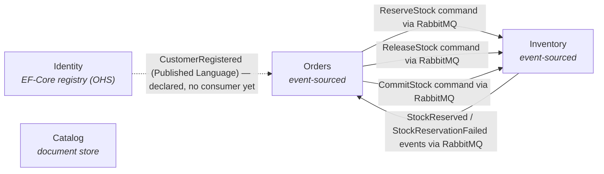

# CritterMart — Context Map

This document is the integration backdrop for CritterMart's bounded contexts. It names each context's deployment status and persistence shape, draws the integration topology, and uses DDD strategic-design vocabulary to label the relationships between contexts. The Event Modeling workshop and later slice work reference this map when answering cross-BC questions.

For *what* each bounded context is about, see [`docs/vision.md`](../vision.md). For the deployment-shape rationale, see [ADR 001](../decisions/001-separate-services-topology.md), [ADR 003](../decisions/003-wolverine-rabbitmq-transport.md), [ADR 006](../decisions/006-wolverine-http-per-service-no-bff.md), and [ADR 009](../decisions/009-polecat-deferred-for-round-one.md).

## Bounded contexts

- **Catalog** — deployed service, document store. Hosts products, prices, and descriptions; the "when CRUD is fine" example.
- **Inventory** — deployed service, event-sourced. Tracks stock per SKU; the textbook event-sourcing case.
- **Orders** — deployed service, event-sourced. Contains the Cart and Order aggregates; Order is the process manager for fulfilling a purchase (see [ADR 007](../decisions/007-process-manager-via-handlers-for-order.md)).
- **Identity** — **promoted** from round-one stub to a kept EF-Core **customer registry** — the one non-event-sourced BC (current-state rows, not events). A *data store*, NOT an auth provider: no Polecat, no authN/authZ ([ADR 009](../decisions/009-polecat-deferred-for-round-one.md) holds); the `X-Customer-Id` seam stays the identity transport. **Open-Host Service** (`GET /customers/{id}`, storefront-facing) + **Published Language** (`CustomerRegistered`). Spike-realized on `spike/efcore-identity` (slices 5.1/5.2); code lands on `main` via the per-slice chain. See [Workshop 002](../workshops/002-identity-event-model.md).

## Topology

Solid edges are active round-one integrations over RabbitMQ. The dashed edge is Identity's **Published Language** (`CustomerRegistered`): declared by the promotion but with no consumer yet — the spike publishes it to RabbitMQ unconsumed. Identity also exposes an **Open-Host Service** read API (`GET /customers/{id}`) for the storefront; that is not drawn because it is frontend-facing HTTP (like Catalog's product reads), not a cross-BC edge.

## Integration relationships

| Pair | Pattern | Upstream | Messages | Notes |
| --- | --- | --- | --- | --- |
| Orders ↔ Inventory | Customer-Supplier | Inventory | `ReserveStock` command from Orders; `StockReserved` and `StockReservationFailed` events back to Orders; `ReleaseStock` command from Orders on cancellation; `CommitStock` command from Orders on confirmation | Bidirectional flow over RabbitMQ. Orders is the customer; Inventory is the supplier whose capacity gates fulfillment. Every terminal order state has an Inventory consequence: confirm → `CommitStock`, cancel → `ReleaseStock`. |
| Identity → Orders (and future consumers) | Open-Host Service + Published Language | Identity | `CustomerRegistered` (Published-Language event, via the EF-Core outbox → RabbitMQ); `GET /customers/{id}` (Open-Host Service, storefront-facing) | Kept EF-Core registry ([Workshop 002](../workshops/002-identity-event-model.md)). Identity publishes a stable customer contract; consumers subscribe rather than negotiate. **Declared now, no active traffic yet** — the spike publishes `CustomerRegistered` unconsumed. Cross-BC consumers resolve customer data from a LOCAL read model fed by the PL event (slice 5.4), never a sync call into Identity (ADR 001 forbids sync service-to-service HTTP); the OHS read API is for the storefront, like Catalog's product reads. |

**Catalog has no BC-level integration with the other services in round one.** Product information flows through the frontend, which reads Catalog over HTTP and passes the relevant product fields into Cart commands. The Cart aggregate snapshots that product data at add-to-cart time. This is presentation-layer composition, not a bounded-context integration, and the talk acknowledges the distinction.

## Round-one stubs and deferrals

- **No synchronous service-to-service HTTP.** Per ADR 001 and ADR 003, cross-service traffic is brokered messaging only.
- **Identity registry promoted; auth still stubbed.** The Identity *registry* is promoted to a kept EF-Core service ([Workshop 002](../workshops/002-identity-event-model.md), Open-Host Service + Published Language); its code lands on `main` via the per-slice chain. *Authentication* remains stubbed per ADR 009 — no Polecat, no claims; the `X-Customer-Id` seam still carries a hardcoded id from the frontend. The registry is a data store, not an auth provider.
- **No Payments service.** Payment authorization is stubbed inside the Orders service; see [ADR 007](../decisions/007-process-manager-via-handlers-for-order.md) for how Orders models the payment timeout as a self-scheduled message.
- **No Returns BC, no Promotions BC, no marketplace listings, no vendor BC.** Out of scope per [`docs/vision.md`](../vision.md)'s deliberate non-goals.

## Long road

Relationships that would appear in future rounds and the DDD patterns they would likely take:

- **Real authentication for Identity.** Distinct from the round-two Identity *registry* promotion ([Workshop 002](../workshops/002-identity-event-model.md), now Open-Host Service + Published Language): a real authN/authZ lifecycle — credentials, sessions, claims — is a separate long-road effort that could sit alongside or absorb the registry. The registry promotion is explicitly a *data store*, not auth (ADR 009). The auth mechanism itself is not yet chosen; ADR 009's 2026-07-07 correction struck an earlier factual error that attributed this to Polecat (a SQL Server document/event store, unrelated to identity/auth).
- **A Returns BC.** Likely Customer-Supplier with both Orders (for the originating purchase) and Inventory (for restocking); an Anti-Corruption Layer is plausible if the Returns model diverges from Orders' line-item shape.
- **Promotions with DCB-protected coupon redemption.** Published-Language for the coupon definitions Orders consumes at checkout.
- **Catalog publishing `ProductPriceChanged` events.** Orders subscribes for repricing in-flight carts; Published-Language for the price-change event shape.
