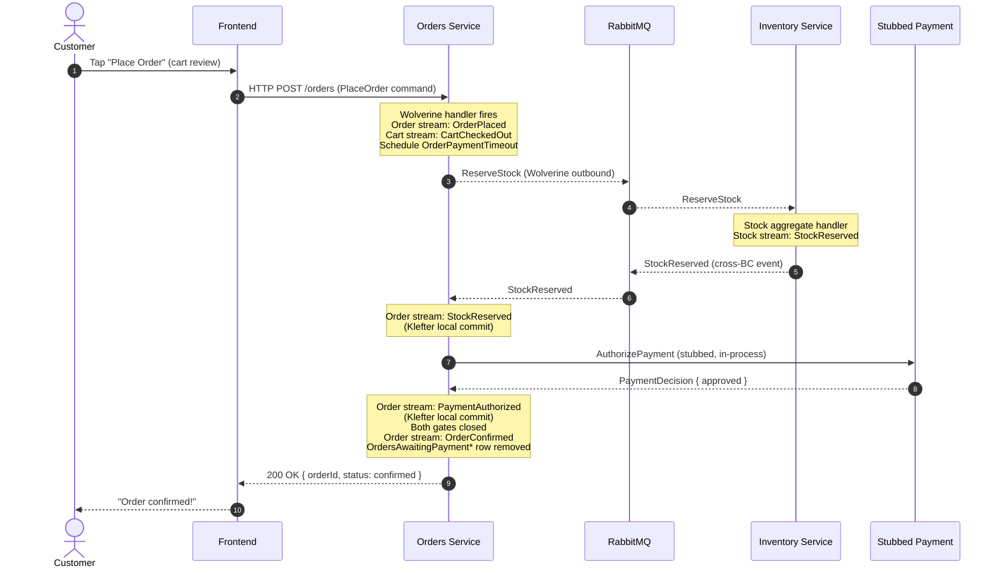

# Workshop 001 — CritterMart Round-One Rolled-Up Event Model

## 1. Scope

**In scope.** A single rolled-up Event Modeling artifact covering the four bounded contexts named in `docs/vision.md`: Catalog (deployed, document store), Inventory (deployed, event-sourced), Orders (deployed, event-sourced, contains Cart and Order aggregates), and Identity (stubbed for round one). The round-one slices covered are those implied by the vision's success criteria: catalog browse, cart manipulation with abandonment captured from day one, checkout and order placement, cross-BC stock reservation and stubbed payment authorization, order completion or timeout-driven cancellation, and the one async-projection teaser called for by ADR 008. The Place Order journey is the centerpiece and is rendered as a full storyboard for the OpenTelemetry trace demo (ADR 005).

**Deferred to the parking lot.** Long-road items from the vision — promotions, returns, marketplace listings, vendor portal, real payment integration, Polecat-backed Identity, broader async projection use, BFF. These appear as one-line entries in Section 9 only.

**Domain Storytelling was skipped** per `CLAUDE.md` § 2 and the routing of `docs/vision.md` § "Bounded contexts": CritterMart's single-seller domain has unambiguous shared vocabulary across the four BCs. Phase 1's brain dump proceeded directly.

---

## 2. Bounded-Context Summary

### Catalog (deployed; Marten document store)

The "when CRUD is fine" example. Persistence is the Marten document store; there is no event-sourced aggregate. The `Product` document is the model. Catalog has no BC-level integration with Orders or Inventory in round one (per the context map): product information flows through the frontend, which reads Catalog over HTTP and snapshots the relevant product fields into Cart commands at add-to-cart time. The "events" in Catalog are *lifecycle moments* — published-product, price-changed — captured for audit, not for state reconstruction. They are first-class in this workshop but produce no projections downstream other than the Catalog's own list/detail views.

Primary events: `ProductPublished`, `ProductPriceChanged`. (Optional: `ProductDiscontinued`, parked.)

### Inventory (deployed; event-sourced)

The textbook event-sourcing case. The `Stock` aggregate is keyed per SKU; the stream records physical and reservation lifecycle. Inline snapshot projections feed a `StockLevelView` read model used by Orders' process manager indirectly (Orders never reads the view, but the projection drives Inventory's own internal decisions). Inventory is the supplier in the Orders ↔ Inventory Customer-Supplier relationship from the context map.

Primary events on the Stock stream: `StockReceived`, `StockReserved`, `StockReleased`. (Out-of-stream message: `StockReservationFailed` is an outbound Wolverine message back to Orders but is *not* persisted on the Stock stream — there's no state change to record. Orders captures it on its own stream as a Klefter translation-decision event.)

**Replenishment saga (v1.12 forward increment, not yet implemented).** Slices 2.5–2.7 add a `Replenishment` saga keyed per SKU: when a `ReserveStock` cannot be filled, Inventory opens a saga that requests a restock, awaits it, and escalates on a timeout. This is CritterMart's **first convention `Wolverine.Saga`** — a deliberate, additive counterpart to the Order aggregate's Process Manager via Handlers (the "no `Wolverine.Saga`" stance in the § 2 *Orders* note below is Order-specific, ADR 007). Its state lives in **saga storage, not on the Stock stream**, and is deleted on completion; the slice 2.2 reserve-failure path is unchanged (the saga is a separate reaction to the same shortfall). Modeling detail in § 4's "Saga state and saga messages" subsection and slices 2.5–2.7.

### Orders (deployed; event-sourced)

Two event-sourced aggregates live here:

- **Cart aggregate.** Holds the customer's selection prior to checkout. Lifecycle: `CartCreated` → `CartItemAdded`/`CartItemRemoved`/`CartItemQuantityChanged` → either `CartCheckedOut` (terminal-success) or `CartAbandoned` (terminal-abandonment via Bruun temporal automation).
- **Order aggregate.** Acts as its own process manager per the Process Manager via Handlers pattern from ADR 007 — there is no separate saga state stream and no `Wolverine.Saga` base class. State flags on the Order stream (`StockReserved`, `PaymentAuthorized`) track progress through the two gates; terminal events (`OrderConfirmed`, `OrderCancelled`) close the stream. A scheduled `OrderPaymentTimeout` self-message is idempotent against the stream state.

Order-stream events include the four load-bearing names from ADR 007 (`StockReserved`, `PaymentAuthorized`, `OrderConfirmed`, `OrderCancelled`) plus `OrderPlaced`, `StockReservationFailed`, and `PaymentAuthFailed`. The last three are Klefter translation-decision events: they capture decisions made elsewhere (Inventory's refusal, the stubbed provider's response) as first-class events on the Order's own stream, providing the audit trail the BC needs to reason about its own history.

### Identity (stubbed for round one)

Per ADR 009 and the context map, Identity is not a deployed service in round one. A customer identifier is hardcoded into the frontend and flows through commands as if it came from a real identity system. The three deployed services accept the customer-ID shape without translation (Conformist relationship). No events, no streams, no projections in this context.

---

## 3. Timeline / Storyboard — Place Order Journey

This is the centerpiece. The talk's OpenTelemetry trace demo (per ADR 005) walks this sequence; all spans listed below are visible in the Aspire dashboard.



**Storyboard interpretation:**

- **UI moments.** Two screens flank the timeline: the cart review (Customer taps "Place Order") on the left, and the confirmation screen (or status-pending screen) on the right. Between them, all activity is system-driven and not directly visible to the customer beyond a status indicator.
- **Commands.** Two commands enter the system from outside: `PlaceOrder` from the frontend, and `ReserveStock` from Orders to Inventory (cross-BC). Both are Wolverine messages; `ReserveStock` rides over RabbitMQ per ADR 003.
- **Klefter local commits.** Three events on the Order stream are Klefter translation-decision events: `StockReserved`, `PaymentAuthorized` (and on the failure branches, `StockReservationFailed` and `PaymentAuthFailed`). Each one records an external decision as a first-class fact on the Order's own stream.
- **OTel spans.** The trace covers: HTTP POST `/orders` on the Orders side; Wolverine handler invocation; Marten event-append (per ADR 005, Marten's `TrackLevel.Verbose` instrumentation); outbound message produce span; broker span; inbound message handler on Inventory; Marten event-append on Inventory; outbound message produce span; broker span; inbound message handler back on Orders; Marten event-appends for the Klefter events; final HTTP response. The cross-service span chain is exactly what the talk demonstrates.

**Storyboards for BC-internal flows** (Cart manipulation, Catalog browsing, stock receipt) are intentionally not drawn as full sequence diagrams here. They are simpler `UI → Command → Event → View` shapes captured in the slice table (Section 6) and GWT scenarios (Section 7). The Place Order storyboard above is the only one that earns a full sequence diagram because it's the only flow that crosses BCs.

---

## 4. Event Vocabulary

Alphabetical within each BC. Past tense, no `Event` suffix, domain-meaningful. This list is the authoritative naming source for downstream OpenSpec proposals, narratives, and code.

### Catalog

- **ProductPriceChanged** — a product's listed price was changed. Lifecycle audit moment; not state-reconstruction.
- **ProductPublished** — a product is now visible in the catalog. Lifecycle audit moment.

### Inventory

- **StockReceived** — physical stock was added to inventory for a SKU.
- **StockReleased** — previously-reserved stock was returned to available capacity (typically as a compensation for `OrderCancelled`).
- **StockReserved** — stock was reserved against a specific order. State change on the Stock stream; also published cross-BC and consumed by Orders into its own stream as a Klefter local commit.

### Orders — Cart aggregate

- **CartAbandoned** — a cart was determined to have been abandoned via Bruun temporal automation (no further activity by the scheduled deadline). Terminal for the Cart stream.
- **CartCheckedOut** — a cart was checked out into an order. Terminal-success for the Cart stream; paired with `OrderPlaced` on the Order stream.
- **CartCreated** — a new cart was started for a customer (first item added).
- **CartItemAdded** — an item was added to a cart.
- **CartItemQuantityChanged** — the quantity of an existing line item changed.
- **CartItemRemoved** — an item was removed from a cart.

### Orders — Order aggregate

- **OrderCancelled** — terminal: the order was cancelled. Carries a reason payload (`stock_unavailable`, `payment_declined`, `payment_timeout`). When non-empty stock reservation existed, this event is published cross-BC for Inventory to release stock.
- **OrderConfirmed** — terminal: both stock and payment gates closed; the order is committed.
- **OrderPlaced** — an order was placed; the process manager begins. Cart's `CartCheckedOut` is paired with this on the Cart stream.
- **PaymentAuthFailed** — Klefter local commit: Orders records the stubbed payment provider's refusal as a first-class event on the Order stream.
- **PaymentAuthorized** — Klefter local commit: Orders records the stubbed provider's authorization as a first-class event on the Order stream.
- **StockReservationFailed** — Klefter local commit: Orders records Inventory's refusal as a first-class event on the Order stream. Note: not on the Stock stream — Inventory's refusal is not a state change there.
- **StockReserved** — Klefter local commit: Orders records Inventory's grant of stock on the Order stream. Same name as the Stock-stream event; conceptually the same fact, persisted in both streams for their respective purposes.

### Self-scheduled messages (NOT events on any stream)

These are Wolverine messages a service sends to itself with a future delivery time. They are not appended to any stream — they trigger handlers that may then append events.

- **CartActivityTimeout** — scheduled when cart activity occurs; if no further activity by deadline, the handler emits `CartAbandoned` (Bruun temporal automation, slice 3.4).
- **OrderPaymentTimeout** — scheduled when `OrderPlaced`; if the Order stream is not terminal at deadline, the handler emits `OrderCancelled` with reason `payment_timeout` (Bruun temporal automation, slice 4.7; per ADR 007).
- **ReplenishTimeout** — scheduled when a `Replenishment` saga opens (slice 2.5); if the SKU's shortfall is still outstanding when the deadline passes, the saga escalates and completes (slice 2.7). The Inventory analogue of `OrderPaymentTimeout`, but it advances *saga* state, not a stream — see "Saga state and saga messages" below. (Wolverine `TimeoutMessage`; v1.12 forward increment.)

### Saga state and saga messages (NOT events on any stream) — v1.12 forward increment

The **Replenishment saga** (Inventory, slices 2.5–2.7) is CritterMart's **first convention `Wolverine.Saga`** — modeled here, not yet implemented. It is the deliberate contrast to the Order aggregate's Process Manager via Handlers (ADR 007, which forgoes the saga base class *for the Order*): the Order keeps its process state **on its event stream**; the Replenishment saga keeps its state in **saga storage** — a Marten document keyed by SKU, **deleted on `MarkCompleted()`**, never event-sourced. Transient coordination state is exactly what a saga is for, and *not* event-sourcing it is the teaching point. It is also the third member of the "ways to wait for a deadline" trio: Bruun temporal automation (todo-list projection + self-message, slices 3.4/4.7) vs. a convention saga (saga document + `TimeoutMessage`).

- **Replenishment** *(saga state, not a stream)* — one open instance per backordered SKU, keyed by SKU. Tracks the outstanding shortfall while a restock is awaited; `MarkCompleted()` (which deletes the state) fires when the shortfall is covered (slice 2.6) or escalated at timeout (slice 2.7).
- **RequestRestock** *(outbound message, not an event)* — the saga's request to replenish a SKU. Round-one stub: a logged/notified "supplier order," fulfilled in practice by the Operator's existing `ReceiveStock` path (slice 2.1) — there is no new fulfillment mechanism.
- **RestockArrived** *(message, not an event)* — the signal that a SKU was restocked, correlated to the saga by SKU. Whether this is a dedicated message or the forwarded `StockReceived` stream event (Marten→Wolverine event forwarding, daemon-free per ADR 008) is an open implementation question — see § 8 item 15.

### Identity

No events. Identity is stubbed.

---

## 5. Slice Table

Per the skill's Structured Output Format, augmented with `Reads-from` and `Writes-to` columns per CLAUDE.md § 3. Slices that span BCs note the chain with `→` in the BC column. `*(query)*` denotes a read-only slice; `*(scheduled)*` denotes a clock-triggered slice; `*(system)*` denotes a slice triggered by an upstream event/command from inside the same service; `*(saga)*` denotes a slice whose state lives in a Wolverine convention saga rather than an event stream.

| #   | Slice                                              | Command                  | Events                                              | View                                          | BC                        | Reads-from                                 | Writes-to                                                                     | Priority |
| --- | -------------------------------------------------- | ------------------------ | --------------------------------------------------- | --------------------------------------------- | ------------------------- | ------------------------------------------ | ----------------------------------------------------------------------------- | -------- |
| 1.1 | Publish a product                                  | `PublishProduct`         | `ProductPublished`                                  | `ProductCatalogView`                          | Catalog                   | —                                          | Product document; `ProductCatalogView`                                        | P0       |
| 1.2 | Browse and view products                           | *(query)*                | —                                                   | `ProductCatalogView`                          | Catalog                   | `ProductCatalogView`                       | —                                                                             | P0       |
| 1.3 | Change a product's price                           | `ChangeProductPrice`     | `ProductPriceChanged`                               | `ProductCatalogView`                          | Catalog                   | Product document                           | Product document; `ProductCatalogView`                                        | P2       |
| 2.1 | Receive stock                                      | `ReceiveStock`           | `StockReceived`                                     | `StockLevelView`                              | Inventory                 | —                                          | Stock stream; `StockLevelView`                                                | P0       |
| 2.2 | Reserve stock for an order                         | `ReserveStock`           | `StockReserved` (or `StockReservationFailed` msg)   | `StockLevelView`                              | Orders → Inventory        | Stock stream                               | Stock stream (on grant); outbound msg to Orders; `StockLevelView`             | P0       |
| 2.3 | Release reserved stock on order cancellation       | *(system)* via `OrderCancelled` event from Orders | `StockReleased`            | `StockLevelView`                              | Orders → Inventory        | Stock stream                               | Stock stream; `StockLevelView`                                                | P0       |
| 2.4 | Commit reserved stock on order confirmation        | *(system)* via `OrderConfirmed` from Orders       | `StockCommitted`           | `StockLevelView`                              | Orders → Inventory        | Stock stream                               | Stock stream; `StockLevelView`                                                | P0       |
| 2.5 | Open replenishment on stock shortfall *(saga)*     | *(system)* on `ReserveStock` shortfall            | — *(starts `Replenishment` saga; no stream event)* | `StockLevelView`             | Inventory                 | Stock stream / `StockLevelView` (shortfall) | `Replenishment` saga state; outbound `RequestRestock`; `ReplenishTimeout` scheduled | P1       |
| 2.6 | Resolve replenishment on restock *(saga)*          | *(system)* `RestockArrived` (or forwarded `StockReceived`) | — *(completes/reduces `Replenishment` saga)* | `StockLevelView`             | Inventory                 | `Replenishment` saga state; Stock stream    | `Replenishment` saga `MarkCompleted` (or reduced `outstanding`)               | P1       |
| 2.7 | Escalate replenishment on timeout *(saga)*         | *(scheduled)* `ReplenishTimeout` self-message     | — *(completes `Replenishment` saga)*           | —                            | Inventory                 | `Replenishment` saga state                  | operator escalation; `Replenishment` saga `MarkCompleted`                     | P1       |
| 3.1 | Add item to cart                                   | `AddToCart`              | `CartCreated` (first time), `CartItemAdded`         | `CartView`                                    | Orders                    | Cart stream                                | Cart stream; `CartView`; refresh `CartActivityTimeout`                        | P0       |
| 3.2 | Remove item from cart                              | `RemoveCartItem`         | `CartItemRemoved`                                   | `CartView`                                    | Orders                    | Cart stream                                | Cart stream; `CartView`; refresh `CartActivityTimeout`                        | P0       |
| 3.3 | Change cart item quantity                          | `ChangeCartItemQuantity` | `CartItemQuantityChanged`                           | `CartView`                                    | Orders                    | Cart stream                                | Cart stream; `CartView`; refresh `CartActivityTimeout`                        | P1       |
| 3.4 | Abandon cart on inactivity (Bruun pattern)         | *(scheduled)* `CartActivityTimeout` self-message | `CartAbandoned`           | `CartAbandonmentReport` (async — see §8)      | Orders                    | `CartsAwaitingActivity*`; Cart stream      | Cart stream; `CartsAwaitingActivity*` row removed; `CartAbandonmentReport`    | P1       |
| 3.5 | View my open cart *(round-two view slice)*         | *(query)*                | —                                                   | `CartView`                                    | Orders                    | `CartView` (resolved by `customerId` via the partial-unique open-cart index) | —                                                                             | P0       |
| 4.1 | Place order from cart                              | `PlaceOrder`             | `OrderPlaced`; `CartCheckedOut`                     | `OrderStatusView` (awaiting confirmation)     | Orders                    | Cart stream; Catalog snapshot in command   | Order stream; Cart stream; `OrderStatusView`; `OrdersAwaitingPayment*` row added; `OrderPaymentTimeout` scheduled | P0       |
| 4.2 | Reserve stock cross-BC                             | *(system)* outbound `ReserveStock` to Inventory; consumes `StockReserved` or `StockReservationFailed` back | `StockReserved` (Klefter local commit) OR `StockReservationFailed` (Klefter local commit) | `OrderStatusView` | Orders ↔ Inventory | Order stream | Order stream; `OrderStatusView`                                          | P0       |
| 4.3 | Authorize payment (Klefter translation-decision)   | *(system)* outbound `AuthorizePayment` to stubbed provider | `PaymentAuthorized` (Klefter local commit) OR `PaymentAuthFailed` (Klefter local commit) | `OrderStatusView` | Orders | Order stream | Order stream; `OrderStatusView`                                                                                | P0       |
| 4.4 | Confirm order when both gates closed               | *(aggregate decision)* on stream state | `OrderConfirmed` | `OrderStatusView` (confirmed)                 | Orders                    | Order stream                               | Order stream; `OrderStatusView`; `OrdersAwaitingPayment*` row removed         | P0       |
| 4.5 | Cancel order on stock-reservation failure          | *(aggregate decision)* on `StockReservationFailed` | `OrderCancelled` (reason: `stock_unavailable`) | `OrderStatusView` (cancelled) | Orders | Order stream | Order stream; `OrderStatusView`; `OrdersAwaitingPayment*` row removed (no cross-BC release — no reservation existed) | P0       |
| 4.6 | Cancel order on payment-auth failure               | *(aggregate decision)* on `PaymentAuthFailed` | `OrderCancelled` (reason: `payment_declined`) | `OrderStatusView` (cancelled) | Orders → Inventory | Order stream | Order stream; `OrderStatusView`; `OrdersAwaitingPayment*` row removed; outbound `OrderCancelled` to Inventory | P0       |
| 4.7 | Cancel order on payment timeout (Bruun pattern)    | *(scheduled)* `OrderPaymentTimeout` self-message | `OrderCancelled` (reason: `payment_timeout`) | `OrderStatusView` (cancelled) | Orders → Inventory | Order stream; `OrdersAwaitingPayment*`     | Order stream; `OrderStatusView`; `OrdersAwaitingPayment*` row removed; outbound `OrderCancelled` to Inventory | P0       |

**Slice count by BC.** Catalog: 3 (1 P2). Inventory: 7 (incl. replenishment-saga slices 2.5–2.7 — v1.12 forward increment, not yet implemented). Orders Cart: 5 (incl. round-two view slice 3.5). Orders Place Order journey: 7. Total: 22.

**Slice priority distribution.** P0: 16. P1: 5 (`ChangeCartItemQuantity`, `CartAbandoned`, and replenishment-saga slices 2.5–2.7). P2: 1 (`ChangeProductPrice`).

**Pattern citations in the table.**

- Bruun temporal-automation pattern is cited on slice 3.4 (`CartAbandoned` via `CartsAwaitingActivity*`) and slice 4.7 (`OrderCancelled` via `OrdersAwaitingPayment*`). The asterisk suffix marks the todo-list projection as a Bruun temporal-automation source.
- Klefter translation-decision pattern is cited on slices 4.2, 4.3, 4.5, 4.6: any time Orders commits an external decision (Inventory's refusal, the stubbed provider's response) as a local event on its own stream.
- The convention **Wolverine Saga** pattern is cited on slices 2.5–2.7 (the `Replenishment` saga) via the `*(saga)*` marker — CritterMart's first use of the `Wolverine.Saga` base class, a deliberate additive contrast to the Order aggregate's PMvH (ADR 007). State lives in saga storage, not on a stream; see § 4 "Saga state and saga messages." (v1.12 forward increment.)

---

## 5.1 Wireframe Dimension (round-two frontend amendment, ADR 016)

Round one under-ran Event Modeling's view half: § 3's storyboard named "two screens flank the timeline" without drawing them, and the § 5 table carried a `View` column (the read model a screen binds to) but no wireframe. [ADR 016](../decisions/016-frontend-full-pipeline-ui-first-class.md) makes the UI first-class and calls for a **proportional** amendment — the wireframe dimension plus sketches of the net-new view slices, *not* a per-slice re-draw. This subsection is that amendment.

**Realized as a dimension subsection, not a literal column.** ADR 016's wording is "a `Wireframe` column is added to the slice table." The round-one § 5 table is already nine columns across eighteen rows, most of them system-, operator-, or seller-facing rows that carry no customer wireframe; widening it to a tenth column that reads `—` for two-thirds of its rows would cost readability for little gain. The dimension is instead expressed here as a focused **slice → screen map** plus the sketches. The deliberate column→subsection divergence is recorded in this session's retrospective.

**The presentation-state guardrail (ADR 016) governs what is — and isn't — modeled here.** An interaction that **reads a domain fact** is a view/query slice with a wireframe (so slice 3.5 below is modeled). An interaction that **produces a domain fact** is already a command slice — it simply gains a wireframe attachment (slices 3.1–3.3, 4.1). **Pure presentation state** — a modal opening, pagination, a theme toggle, the cart-badge animation — is **not an event** and lives only in frontend code and Narrative 005, never on a stream.

### Slice → screen map (customer-facing slices)

| Slice | Customer screen | Wireframe | Reads | Produces (command) |
| --- | --- | --- | --- | --- |
| 1.2 Browse and view products | Browse / Listing | **W1** | `ProductCatalogView` | — *(query)* |
| 3.1 Add item to cart | Browse / Listing (cart badge) | **W1 → W2** | `CartView` | `AddToCart` |
| 3.2 Remove item · 3.3 Change quantity | Cart Review | **W2** | `CartView` | `RemoveCartItem` · `ChangeCartItemQuantity` |
| **3.5 View my open cart** *(NEW)* | Cart Review | **W2** | `CartView` (by `customerId`) | — *(query)* |
| 4.1 Place order from cart | Cart Review → Confirmation | **W2 → W3** | `CartView`, then `OrderStatusView` | `PlaceOrder` |
| 4.2–4.7 order lifecycle (status only) | Order Status / Tracking | **W4** | `OrderStatusView` | — *(system; status is read, not driven)* |

Round-one slices **not** in this map carry no customer wireframe by design: catalog management (1.1, 1.3) is the Seller's surface; stock (2.1–2.4) is the Operator's/system's; cart abandonment (3.4) and the order-lifecycle decisions (4.2–4.7) are system- or clock-driven (the customer sees only their *result*, as a `OrderStatusView` status on W4). The operator todo-lists (`OrdersAwaitingPayment*`, `CartsAwaitingActivity*`) are operator-facing and outside the customer storefront this pass.

### W1 — Browse / Listing  *(slice 1.2; folds product-detail Gap #2)*

```text
+----------------------------------------------------------+
|  CritterMart                                 [ Cart (2) ] |
+----------------------------------------------------------+
|  Products                                                |
|                                                          |
|  +--------------------+    +--------------------+         |
|  | Cosmic Critter     |    | Nebula Newt        |         |
|  | Plush              |    |                    |         |
|  | crit-001           |    | crit-002           |         |
|  | $24.99             |    | $18.00             |         |
|  | "a plush gremlin"  |    | "a vinyl newt"     |         |
|  | [  Add to cart  ]  |    | [  Add to cart  ]  |         |
|  +--------------------+    +--------------------+         |
+----------------------------------------------------------+
```

- **reads** `ProductCatalogView` — `GET /products` direct from Catalog (no BFF, [ADR 006](../decisions/006-wolverine-http-per-service-no-bff.md)); Zod-parsed at the boundary before the app trusts it (ADR 015 R3).
- **`[ Add to cart ]`** issues `AddToCart` (slice 3.1); the cart badge bumps optimistically and reconciles against a refetched `CartView` (ADR 015 R4 — the read model, never the optimistic guess, is the source of truth).
- **product detail** is rendered from the list payload — there is no `GET /products/{sku}` (Gap #2, low; deep-linkable detail deferred). The stubbed customer id ([ADR 009](../decisions/009-polecat-deferred-for-round-one.md)) rides along but gates nothing — the catalog is public.

### W2 — Cart Review  *(slice 3.5 reads the cart; slices 3.2/3.3 edit it; slice 4.1 checks out)*

```text
+----------------------------------------------------------+
|  CritterMart                                 [ Cart (2) ] |
+----------------------------------------------------------+
|  Your cart                                               |
|                                                          |
|  Cosmic Critter Plush  crit-001  $24.99  [-] 2 [+]  [x]  |
|  Nebula Newt           crit-002  $18.00  [-] 3 [+]  [x]  |
|                                          -------------    |
|                                  Total        $103.98    |
|                                                          |
|                                       [   Place Order  ] |
+----------------------------------------------------------+
```

- **reads** `CartView` **resolved by customer** — slice **3.5 (NEW)**: `GET /carts/mine` (identity carried per the ADR 009 seam) returns the customer's one open cart, or "no open cart." This is **Gap #1 / BLOCKING**: every cart *command* is customer-keyed (the server resolves the open cart), but the only round-one cart *read* is `GET /carts/{cartId}` — so on a **cold load** the SPA, holding only the stubbed customer id, has no `cartId` and cannot render this screen. Slice 3.5 closes that, exposing the existing `CartView` over the existing partial-unique open-cart index (`Orders/Program.cs:74`). No new event.
- **`[-]` / `[+]`** issue `ChangeCartItemQuantity` (slice 3.3); **`[x]`** issues `RemoveCartItem` (slice 3.2) — both optimistic, both reconciling against the refetched `CartView`. Quantity never re-prices; the snapshot price holds (Narrative 004, Moment 1A).
- **empty cart stays open**: removing every line keeps it as the customer's open cart, just empty — the one thing it cannot do is `PlaceOrder` (`CartEmpty`).
- **`[ Place Order ]`** issues `PlaceOrder` (slice 4.1) → W3.

### W3 — Order Confirmation  *(slice 4.1 payoff)*

```text
+----------------------------------------------------------+
|  CritterMart                                 [ Cart (0) ] |
+----------------------------------------------------------+
|                                                          |
|        Order placed.                                     |
|                                                          |
|        Order    ord-7f3a                                 |
|        Status   awaiting confirmation   (o)              |
|        Total    $103.98                                  |
|                                                          |
|        [  Track this order  ]                            |
|                                                          |
+----------------------------------------------------------+
```

- **returned by** the `PlaceOrder` response `{ orderId, status }` (slice 4.1).
- **status is `awaiting_confirmation`** — an *honest* pending state, **not** a faked "confirmed." Unlike a cart edit (W2), placement cannot be optimistically resolved: it kicks off the cross-BC reserve-stock + authorize-payment process whose outcome the SPA does not yet know. This is the one beat where optimism stops and the SPA waits for server truth.
- **cart badge resets to 0** — the checked-out cart is no longer the customer's open cart (a fresh one starts on the next `AddToCart`).
- **the trace beat**: this `POST /orders` is the *front door* of the OpenTelemetry cross-service trace the talk demonstrates (ADR 015 § Consequences / vision success criterion) — the real HTTP hop from SPA into Orders, before the broker fan-out to Inventory.
- **`[ Track this order ]`** → W4.

### W4 — Order Status / Tracking  *(reads `OrderStatusView`; single order)*

```text
+----------------------------------------------------------+
|  CritterMart                                 [ Cart (0) ] |
+----------------------------------------------------------+
|  Order  ord-7f3a                                         |
|                                                          |
|  Status   confirmed                                      |
|           awaiting -> stock reserved -> confirmed        |
|  Placed   2026-06-14 14:02 UTC                           |
|                                                          |
|  Cosmic Critter Plush  crit-001   x2          $49.98     |
|  Nebula Newt           crit-002   x3          $54.00     |
|                                   Total      $103.98     |
+----------------------------------------------------------+
```

- **reads** `OrderStatusView` — `GET /orders/{orderId}`, which exists today (the audit's ✅ row); single-order tracking needs no new slice.
- **status walks** `awaiting_confirmation → stock_reserved → confirmed`, or settles on `cancelled` by one of three reasons — `stock_unavailable`, `payment_declined`, `payment_timeout` (the three failure routes of Narrative 004, Moments 3 / 5 / 6).
- **no live push** round one (no SignalR — ADR 015, explicitly unlike CritterBids): the status converges by TanStack Query refetch/poll, never a socket.
- **"My Orders" list** (`GET /orders?customerId=`) is **Gap #3** — named and deferred; single-order tracking covers the round-two storefront.

> **Amendment (v1.10, 2026-06-16 — design-return reconciliation; realized in slice 4.1 / W3 (PR #62) and W4 (PR #64)).** Two § 5.1 wireframe claims drifted from the shipped frontend wire (the W1/W2 sketches are accurate as drawn). The frozen wireframes above are left as the modeling-time record — read them with these corrections:
>
> - **W3 — the place-order response carries only `{ orderId }`, not `{ orderId, status }`.** The "returned by … `{ orderId, status }`" bullet was over-specified: at the moment `POST /orders` answers, the placement has only just kicked off the cross-BC reserve-stock + authorize-payment process, so the server has no settled status to report. W3 therefore *reads the order back* — `GET /orders/{orderId}`, the `OrderStatusView` — for status (`awaiting confirmation`) and total. This is the load-bearing correction **Narrative 005 already carries** (Moment 4 prose + its v1.5 Document History row); the workshop is the lone straggler catching up. No event, command, or read-model change — the wireframe's *honest pending status* beat is unaffected, only the transport that carries the status to the screen.
>
> - **W4 — `OrderStatusView` carries no placed-at timestamp and no cancellation reason; both are backend gaps, not shipped data.** The W4 wireframe's `Placed 2026-06-14 14:02 UTC` line and the "settles on `cancelled` by one of three reasons (`stock_unavailable` / `payment_declined` / `payment_timeout`)" prose imply fields the wire does not carry: the shipped `OrderStatusView` shape is `{ id, customerId, status, lines, total }`, and `OrderCancelled` folds to a bare `Status = "cancelled"` (`src/CritterMart.Orders/Ordering/OrderStatusView.cs:44`) — the three reasons known to Narrative 004 never reach the view. W4 (PR #64) confirmed this and rendered an honest generic "Cancelled" with no placed-at line, logging both as gaps. They are fenced to a **future "enrich `OrderStatusView`" slice** (a projection change — surface a `PlacedAt` from `OrderPlaced` and a reason carried on `OrderCancelled`); until it ships, the wireframe's timestamp and per-reason copy are *aspirational*, not bound. The status walk itself is real, only fuller than drawn: the lifecycle stepper W4 renders is the five-state enum `awaiting → stock reserved → payment authorized → confirmed` (with `cancelled` a terminal branch); the wireframe's collapsed three-step path is a sketch, not the enum.
>
> Realized in `docs/narratives/005-customer-storefront.md` (v1.5 / v1.6) + `docs/retrospectives/implementations/021-slice-w3-place-order.md` (W3) + `docs/retrospectives/implementations/023-slice-w4-order-tracking.md` (W4); recorded in retrospective `docs/013`. No OpenSpec capability change and no new slice — a faithfulness reconciliation of the § 5.1 wireframe dimension to the shipped screens.

> **Amendment (v1.11, 2026-06-17 — the v1.10-fenced "enrich `OrderStatusView`" slice landed).** The W4 placed-at line and per-reason cancel copy that v1.10 fenced as *aspirational, not bound* "until it ships" have **shipped** — as **slice 025 (PR #67)**. The `OrderStatusView` wire shape is now the **additive superset** `{ id, customerId, status, lines, total, placedAt, cancelReason }`: **`placedAt`** is the genesis `OrderPlaced` event's append timestamp (Marten event metadata via `Create(IEvent<OrderPlaced>)` — no new event field), present from the moment the order is placed; **`cancelReason`** folds `OrderCancelled.Reason` — one of `stock_unavailable` / `payment_declined` / `payment_timeout`, null until the order is cancelled. W4 now **binds both**: the wireframe's `Placed … UTC` line renders the real placement time, and the per-reason cancel copy replaces the v1.10-era honest generic "Cancelled." So the W4 wireframe's timestamp and per-reason copy are **bound, no longer aspirational** — only the collapsed three-step status path remains a sketch of the fuller five-state enum (unchanged from v1.10). **Narrative 005 v1.7 already recorded this binding** within the slice PR; the workshop is the lone straggler catching up, exactly as v1.10 framed it. Realized in `openspec/specs/order-lifecycle/spec.md` (8 → 9 requirements; *Surface placement time and cancellation reason in the order view*, archived change `enrich-order-status-view`) + `docs/retrospectives/implementations/025-enrich-order-status-view.md`; recorded in retrospective `docs/014`. No § 5 slice-table change — an additive read-contract enrichment of slice 4.1's `OrderStatusView`, expressed as an OpenSpec ADDED requirement, not a new modeled slice.

> **Amendment (v1.12, 2026-06-17 — Gap #3 "My Orders" list shipped; route shape resolved).** The W4 bullet above records: *"'My Orders' list (`GET /orders?customerId=`) is **Gap #3** — named and deferred; single-order tracking covers the round-two storefront."* That deferral is **now closed.** The "My Orders" list shipped as a customer-keyed order-history screen reading **`GET /orders/mine`** — and the route is the load-bearing correction: it is **header-keyed** (identity in the `X-Customer-Id` header behind the `useCurrentCustomer` seam, ADR 009), **consciously superseding the modeling-time `GET /orders?customerId=` sketch** in the frozen bullet. The query-string form was a modeling-time guess that predates the `GET /carts/mine` convention (slice 3.5); the shipped route mirrors `GET /carts/mine` exactly — the only other customer-scoped read in the service — so identity rides the seam, not the URL (a customer cannot read another's orders by editing a query param), and the header→claim swap stays the lone Polecat-promotion touch. Behaviorally it is a **read-only** addition: a customer-keyed query over the **existing** inline `OrderStatusView` documents (served by a non-unique `OrderStatusView.CustomerId` index, the mirror of the `CartView` read-model index), ordered newest-first, returning every lifecycle state — **no new event, command, projection, or aggregate.** Realized in `openspec/changes/list-my-orders/` (`order-lifecycle` delta, 1 ADDED requirement — *List a customer's own orders*; syncs to `openspec/specs/order-lifecycle/spec.md` 9 → 10 on archive) + Narrative 005 v1.8 (new **Moment 6**) + `docs/retrospectives/implementations/028-list-my-orders.md`. No § 5 slice-table change — like the enrich amendment above, a round-two read expressed as an OpenSpec ADDED requirement, not a new modeled slice. The frozen W4 bullet is left as the modeling-time record; read it with this correction (`?customerId=` → `/orders/mine`, shipped).

---

## 6. GWT Scenarios

One subsection per slice. Happy paths first. Failure paths are explicit per CLAUDE.md § 3 and the prompt's required-failures list: `StockReservationFailed`, `OrderPaymentTimeout` ending in `OrderCancelled`, and cross-BC message-loss / duplicate-delivery handling.

The `Given` clauses reference events already on the relevant stream (preconditions). The `When` clauses name the command, message, or scheduled trigger. The `Then` clauses name the events produced and/or the view state.

### 1.1 Publish a product — `PublishProduct`

**Happy path.**
- **Given** no product exists with SKU `crit-001`.
- **When** the operator issues `PublishProduct { sku: "crit-001", name: "Cosmic Critter Plush", price: 24.99 }`.
- **Then** a `ProductPublished` lifecycle moment is recorded and the `ProductCatalogView` shows the new product.

**Failure path — duplicate publish.**
- **Given** a product with SKU `crit-001` already exists.
- **When** the operator issues `PublishProduct { sku: "crit-001", ... }` again.
- **Then** the command is rejected with `ProductAlreadyPublished` (no new lifecycle moment recorded; idempotent failure).

### 1.2 Browse and view products — *(query)*

**Happy path.**
- **Given** two products are published: `crit-001` and `crit-002`.
- **When** the customer requests `GET /products`.
- **Then** the `ProductCatalogView` returns both products with current price and description.

(No failure path; query slice.)

### 1.3 Change a product's price — `ChangeProductPrice`

**Happy path.**
- **Given** a product with SKU `crit-001` is published at price `24.99`.
- **When** the operator issues `ChangeProductPrice { sku: "crit-001", newPrice: 19.99 }`.
- **Then** a `ProductPriceChanged` lifecycle moment is recorded with the old price (`24.99`) and the new price (`19.99`), and the `ProductCatalogView` reflects `19.99`.

**Note.** This slice illustrates that even a document store benefits from capturing lifecycle moments as first-class events for audit, without going full event-sourced. The product document is the source of truth; the lifecycle moment is the audit trail.

### 2.1 Receive stock — `ReceiveStock`

**Happy path.**
- **Given** no stock stream exists for SKU `crit-001`.
- **When** the operator issues `ReceiveStock { sku: "crit-001", quantity: 100 }`.
- **Then** the Stock stream for `crit-001` records `StockReceived { quantity: 100 }`, and `StockLevelView` shows `available: 100, reserved: 0`.

**Happy path — receiving additional stock.**
- **Given** the Stock stream for `crit-001` records `StockReceived { quantity: 100 }` and `StockReserved { quantity: 30, orderId: "ord-A" }`.
- **When** the operator issues `ReceiveStock { sku: "crit-001", quantity: 50 }`.
- **Then** the Stock stream appends `StockReceived { quantity: 50 }`, and `StockLevelView` shows `available: 120, reserved: 30`.

### 2.2 Reserve stock for an order — `ReserveStock`

**Happy path.**
- **Given** the Stock stream for `crit-001` shows `available: 100, reserved: 0`.
- **When** Inventory receives `ReserveStock { orderId: "ord-A", sku: "crit-001", quantity: 2 }` over RabbitMQ.
- **Then** the Stock stream appends `StockReserved { orderId: "ord-A", quantity: 2 }`, `StockLevelView` shows `available: 98, reserved: 2`, and Inventory publishes a `StockReserved` event back to Orders.

**Failure path — insufficient stock.**
- **Given** the Stock stream for `crit-001` shows `available: 1, reserved: 0`.
- **When** Inventory receives `ReserveStock { orderId: "ord-B", sku: "crit-001", quantity: 2 }`.
- **Then** the Stock stream is **not** modified (no state change to record), and Inventory publishes a `StockReservationFailed { orderId: "ord-B", sku: "crit-001", reason: "insufficient" }` message back to Orders.

**Failure path — duplicate `ReserveStock` delivery (Architect's voice; Wolverine at-least-once).**
- **Given** the Stock stream for `crit-001` shows `available: 98, reserved: 2`, with the existing reservation belonging to `ord-A`.
- **When** Inventory receives `ReserveStock { orderId: "ord-A", sku: "crit-001", quantity: 2 }` a second time (network retry).
- **Then** the handler detects via state guard that a reservation for `ord-A` already exists, the Stock stream is **not** modified, and Inventory re-publishes `StockReserved { orderId: "ord-A", quantity: 2 }` back to Orders (or no-ops; either policy preserves correctness because Orders' state guard also catches the duplicate).

### 2.3 Release reserved stock on order cancellation — `OrderCancelled` event consumption

**Happy path.**
- **Given** the Stock stream for `crit-001` shows `available: 98, reserved: 2`, with reservation against `ord-A`.
- **When** Inventory receives an `OrderCancelled { orderId: "ord-A" }` event from Orders.
- **Then** the Stock stream appends `StockReleased { orderId: "ord-A", quantity: 2 }`, and `StockLevelView` shows `available: 100, reserved: 0`.

**Failure path — `OrderCancelled` arrives for an order with no reservation (timeout before grant).**
- **Given** the Stock stream for `crit-001` has no reservation against `ord-C` (the `ReserveStock` for `ord-C` has not yet been processed, or already failed).
- **When** Inventory receives `OrderCancelled { orderId: "ord-C" }`.
- **Then** the handler detects via state guard that no reservation exists for `ord-C`, the Stock stream is **not** modified, and the handler returns successfully (idempotent no-op).

**Failure path — duplicate `OrderCancelled` delivery.**
- **Given** the Stock stream for `crit-001` already records `StockReleased { orderId: "ord-A" }`.
- **When** Inventory receives a duplicate `OrderCancelled { orderId: "ord-A" }`.
- **Then** the handler detects via state guard that the reservation is already released, the Stock stream is **not** modified, and the handler returns successfully (idempotent no-op).

> **Amendment (v1.2, 2026-05-31 — realized in slices 4.6 + 2.3, PR #35).** As shipped, the cross-BC release does **not** ride the literal `OrderCancelled { orderId }` event written above. Orders translates its cancellation into a **`ReleaseStock { orderId, lines: [{ sku, quantity }] }`** published-language command (`CritterMart.Contracts`, ADR 014), symmetric with `ReserveStock`. Three reasons: Inventory's `StockLevelView.Reservations` stores only order-id strings, so it cannot look up SKUs/quantities from an order id alone (the same wall slice 4.2 hit, resolved the same way — lines ride the message); anti-corruption — Inventory's wire vocabulary stays about *stock*, not *orders*; and reserve/release symmetry. The *behavior* in the GWTs above is honored exactly — release per reserved SKU, idempotent no-op when no reservation is held — only the message name/shape differs. Read "Inventory receives `OrderCancelled { orderId }`" as "Inventory receives `ReleaseStock { orderId, lines }`" throughout this slice. Durable spec: `openspec/specs/stock-management/spec.md`; rationale: archived change `slice-4-6-cancel-on-payment-decline/design.md` Decision 1; see also `docs/narratives/004-customer-purchase.md` (Moment 5) and `docs/retrospectives/implementations/010-slice-4-6-cancel-on-payment-decline.md`.

### 2.4 Commit reserved stock on order confirmation — `CommitStock` command consumption

**Happy path.**
- **Given** the Stock stream for `crit-001` shows `available: 98, reserved: 2`, with reservation against `ord-A`.
- **When** Inventory receives `CommitStock { orderId: "ord-A", lines: [{ sku: "crit-001", quantity: 2 }] }` from Orders.
- **Then** the Stock stream appends `StockCommitted { sku: "crit-001", orderId: "ord-A", quantity: 2 }`, and `StockLevelView` shows `available: 98, reserved: 0, committed: 2`. The order is removed from the SKU's `Reservations` list.

**Failure path — `CommitStock` arrives for an order with no reservation (duplicate or race).**
- **Given** the Stock stream for `crit-001` has no reservation against `ord-A` (never reserved, or already committed by a prior delivery).
- **When** Inventory receives `CommitStock { orderId: "ord-A", lines: [{ sku: "crit-001", quantity: 2 }] }`.
- **Then** the handler detects via state guard that no reservation exists for `ord-A` on this SKU, the Stock stream is **not** modified, and the handler returns successfully (idempotent no-op).

**Failure path — duplicate `CommitStock` delivery.**
- **Given** the Stock stream for `crit-001` already records `StockCommitted { orderId: "ord-A" }`.
- **When** Inventory receives a duplicate `CommitStock { orderId: "ord-A", lines: [{ sku: "crit-001", quantity: 2 }] }`.
- **Then** the handler detects via state guard that the reservation is already committed (order no longer in `Reservations`), the Stock stream is **not** modified, and the handler returns successfully (idempotent no-op).

**Note.** This is the mirror of slice 2.3 (release). Both are cross-BC, both use published-language commands in `CritterMart.Contracts` (ADR 014), both are per-SKU idempotent via the `Reservations` list guard, and both are one-way (no reply to Orders). The difference: release returns stock to `Available`; commit moves it to `Committed`. Together they ensure every reservation on the Stock stream reaches a terminal event — either `StockReleased` or `StockCommitted`. The `StockLevelView` invariant `Available + Reserved + Committed = ΣStockReceived` is assertable after every fold.

### 2.5 Open replenishment on stock shortfall — *(saga)* on `ReserveStock` shortfall

CritterMart's first convention-saga slice (v1.12 forward increment, not yet implemented). When `ReserveStock` cannot satisfy a SKU (the slice 2.2 failure path), Inventory — in addition to refusing the order back to Orders — opens a `Replenishment` saga for the short SKU so future orders can be filled. The saga is a separate, parallel reaction; **slice 2.2's behavior is unchanged** (the order is still refused, the Stock stream is still not modified).

**Happy path — open a backorder.**
- **Given** no `Replenishment` saga is open for SKU `crit-001`, whose Stock stream shows `available: 1`.
- **When** Inventory handles `ReserveStock { orderId: "ord-B", sku: "crit-001", quantity: 2 }` and finds the SKU short (the slice 2.2 refusal).
- **Then** a `Replenishment` saga is started keyed by `crit-001` with `outstanding: 1` (the shortfall), `RequestRestock { sku: "crit-001", quantity: 1 }` is sent (supplier stub), and `ReplenishTimeout { sku: "crit-001" }` is scheduled. The Stock stream is **not** modified (Design A — saga state is not an event), and Orders still receives `StockReservationFailed` exactly as slice 2.2 specifies.

**Failure path — shortfall on an already-backordered SKU (idempotent re-open).**
- **Given** a `Replenishment` saga is already open for `crit-001` with `outstanding: 1`.
- **When** Inventory handles another short `ReserveStock` for `crit-001` (a second customer, shortfall 3).
- **Then** the existing saga is found (one instance per SKU keyed by `[SagaIdentity]` on the SKU) and its `outstanding` is updated rather than a second saga being started; no duplicate timeout race is opened. (The exact aggregation rule — sum vs. max vs. latest — is open question § 8 item 16.)

### 2.6 Resolve replenishment on restock — *(saga)* `RestockArrived` (or forwarded `StockReceived`)

**Happy path — restock covers the shortfall.**
- **Given** a `Replenishment` saga is open for `crit-001` with `outstanding: 1`.
- **When** the Operator receives stock (slice 2.1, `ReceiveStock { sku: "crit-001", quantity: 100 }`) and the resulting restock signal reaches the saga, correlated by SKU.
- **Then** the received quantity (100) covers the outstanding shortfall (1), so the saga calls `MarkCompleted()` and its state is **deleted** from saga storage. The Stock stream records `StockReceived` exactly as slice 2.1 specifies — the saga adds no stream event.

**Failure path — restock for a SKU with no open saga (no-op).**
- **Given** no `Replenishment` saga is open for `crit-002`.
- **When** a restock signal arrives for `crit-002` (every receipt may signal, if the raw `StockReceived` is forwarded).
- **Then** no saga is found for `crit-002`; the signal is a silent no-op (Wolverine's saga `NotFound` path). Receiving stock for a SKU nobody backordered is the common case and must cost nothing.

**Failure path — partial restock (saga stays open).**
- **Given** a `Replenishment` saga is open for `crit-001` with `outstanding: 10`.
- **When** a restock of `quantity: 4` reaches the saga.
- **Then** the shortfall is only partially covered; the saga reduces `outstanding` to 6 and stays open (it does **not** complete), still awaiting a covering restock or its timeout. (Whether a partial restock re-issues `RequestRestock` is open question § 8 item 17.)

### 2.7 Escalate replenishment on timeout — *(scheduled)* `ReplenishTimeout` self-message

The saga's deadline — the Inventory mirror of slice 4.7, and the purest expression of "a saga is just stateful coordination with a timeout."

**Happy path — timeout with shortfall still outstanding (escalate).**
- **Given** a `Replenishment` saga is open for `crit-001` with `outstanding: 1` and its `ReplenishTimeout` fires.
- **When** the saga handles `ReplenishTimeout { sku: "crit-001" }` and the shortfall is still outstanding.
- **Then** the saga escalates — an operator alert / log that `crit-001` went unreplenished — and calls `MarkCompleted()` (state deleted). (Escalate-and-complete vs. escalate-and-re-arm is open question § 8 item 18.)

**Failure path — timeout after the saga already resolved (no-op).**
- **Given** the `Replenishment` saga for `crit-001` already completed (slice 2.6 covered the shortfall) and was deleted.
- **When** the previously-scheduled `ReplenishTimeout { sku: "crit-001" }` is delivered anyway (Wolverine has no scheduled-message cancellation API — the same property slices 3.4/4.7 rely on).
- **Then** no saga is found for `crit-001`; the timeout is a silent no-op (saga `NotFound`). Losing the race to a successful restock is the timer's normal, expected fate — exactly as in slice 4.7.

### 3.1 Add item to cart — `AddToCart`

**Happy path — first item.**
- **Given** no open cart exists for `customer-X`.
- **When** the customer issues `AddToCart { customerId: "customer-X", sku: "crit-001", quantity: 1, productSnapshot: {...} }`.
- **Then** a new Cart stream is created — keyed by a generated `cartId`, with `customerId` riding as a field — recording `CartCreated { cartId, customerId: "customer-X" }` and `CartItemAdded { sku: "crit-001", quantity: 1, snapshot: {...} }`. `CartView` shows the one line. *(Cart-activity timeout scheduling is deferred to slice 3.4 — see the amendment note below and §8 item 1.)*

**Happy path — adding a second item to an existing cart.**
- **Given** the Cart stream shows `CartCreated`, `CartItemAdded { sku: "crit-001", quantity: 1 }`.
- **When** the customer issues `AddToCart { ..., sku: "crit-002", quantity: 3, ... }`.
- **Then** the customer's open cart is resolved by querying `CartView` on `customerId` (a partial-unique index scoped to `IsOpen` carts enforces one open cart per customer), and the Cart stream appends `CartItemAdded { sku: "crit-002", quantity: 3 }`. `CartView` shows two lines. *(The cancel-and-reschedule timeout behavior is deferred to slice 3.4 — see §8 item 1.)*

> **Amendment (v1.1, 2026-05-30 — realized in slice 3.1, PR #25).** The v1.0 wording above implied the Cart stream is keyed by `customerId`. As shipped, slice 3.1 keys the stream by a **generated `cartId`** (parallels the Order stream's `orderId`); `customerId` rides as a field on `CartCreated`, and the customer's single open cart is resolved by querying `CartView` on `customerId` behind a **partial-unique index** (`Predicate "(data ->> 'IsOpen')::boolean = true"`) that enforces one open cart per customer at the database. The **`CartActivityTimeout`** machinery (scheduling, refresh, cancel-and-reschedule) is **deferred to slice 3.4** — slice 3.1 ships no timeout. Durable spec: `openspec/specs/shopping-cart/spec.md`; see also `docs/narratives/004-customer-purchase.md` and `docs/retrospectives/implementations/006-slice-3-1-add-to-cart.md`.

> **Amendment (v1.13, 2026-06-17 — realized in slice 3.1 hardening, PR #69).** Slice 3.1 modeled only happy paths above; a **failure path** is now explicit. An `AddToCart` carrying **no usable product snapshot** is rejected with **`400`** at the boundary — before the customer's open cart is resolved or created — so no `Cart` stream starts and no `CartItemAdded` is appended. A snapshot is *unusable* when it is **absent** (no `productSnapshot`), its **name is blank**, or its **price is negative**. The reason it must be rejected: the cart never reads the Catalog — the storefront-composed snapshot (name + price) is a cart line's *only* source of product truth (Narrative 004 Moment 1, the context map's presentation-layer composition) — so a command with no usable snapshot has nothing from which to build a line, and before the fix it threw a `500` (an NRE in the shared `CartView` fold) rather than refusing cleanly. This is a malformed-*input* rejection, distinct from the cart's domain-state rejections (`CartItemNotPresent`, `NoOpenCart`): those refuse a well-formed command that does not fit the cart's current state; this refuses a command that is not well-formed at all. The guard is a synchronous `Validate(AddToCart) → ProblemDetails` on the endpoint, mirroring `PublishProduct.ValidateAsync`. Durable spec: the ADDED requirement *Reject an add-to-cart command with no usable product snapshot* in `openspec/specs/shopping-cart/spec.md` (synced from the archived change `harden-add-to-cart-snapshot`, shopping-cart 8 → 9); see also `docs/narratives/004-customer-purchase.md` (v1.9, Moment 1) and `docs/retrospectives/implementations/026-harden-add-to-cart-snapshot.md`.

### 3.2 Remove item from cart — `RemoveCartItem`

**Happy path.**
- **Given** the Cart stream contains `CartItemAdded { sku: "crit-001" }` and `CartItemAdded { sku: "crit-002" }`.
- **When** the customer issues `RemoveCartItem { sku: "crit-001" }`.
- **Then** the Cart stream appends `CartItemRemoved { sku: "crit-001" }`. `CartView` shows only `crit-002`.

**Failure path — remove an item not in cart.**
- **Given** the Cart stream contains only `CartItemAdded { sku: "crit-002" }`.
- **When** the customer issues `RemoveCartItem { sku: "crit-001" }`.
- **Then** the command is rejected with `CartItemNotPresent` (no event appended).

### 3.3 Change cart item quantity — `ChangeCartItemQuantity`

**Happy path.**
- **Given** the Cart stream contains `CartItemAdded { sku: "crit-001", quantity: 1 }`.
- **When** the customer issues `ChangeCartItemQuantity { sku: "crit-001", newQuantity: 3 }`.
- **Then** the Cart stream appends `CartItemQuantityChanged { sku: "crit-001", quantity: 3 }`. `CartView` shows `crit-001` with quantity 3.

**Failure path — non-positive quantity.**
- **Given** any cart state.
- **When** the customer issues `ChangeCartItemQuantity { sku: "crit-001", newQuantity: 0 }`.
- **Then** the command is rejected (use `RemoveCartItem` for zero); no event appended.

> **Amendment (v1.4, 2026-06-02 — realized in slices 3.2 + 3.3, PR #39).** Three notes on how these slices shipped. **(1) Cart lines are SKU-keyed (merge-by-SKU).** The GWTs above address lines by SKU but never said what two `CartItemAdded`s for the *same* SKU produce — the line-identity question slice 3.1 deferred. As shipped, the `CartView` fold merges same-SKU adds into one line (quantities summed, the first add's snapshotted name/price authoritative), which is what makes `RemoveCartItem { sku }` and `ChangeCartItemQuantity { sku }` unambiguous. The event stream still records every add. **(2) `ChangeCartItemQuantity` for a SKU not in the cart is rejected with `CartItemNotPresent`** — mirroring slice 3.2's failure path. An extension beyond the non-positive-quantity rejection modeled above. **(3) The slice table's "refresh `CartActivityTimeout`" writes-to clauses on rows 3.2/3.3 remain deferred to slice 3.4** (no timeout machinery exists yet — same deferral slice 3.1 recorded, § 8 item 1). Durable spec: `openspec/specs/shopping-cart/spec.md` (4 requirements); rationale: archived change `slices-3-2-3-3-cart-item-edits/design.md` Decisions 1, 4–5 + faithfulness notes; see also `docs/narratives/004-customer-purchase.md` (Moment 1A) and `docs/retrospectives/implementations/012-slices-3-2-3-3-cart-item-edits.md`.

### 3.4 Abandon cart on inactivity (Bruun temporal automation)

**Happy path.**
- **Given** the Cart stream for `customer-X` shows `CartCreated` and `CartItemAdded`, with a scheduled `CartActivityTimeout` whose deadline has been reached, and no further cart activity has occurred.
- **When** the `CartActivityTimeout` self-message fires.
- **Then** the handler reads the Cart stream, confirms no activity past the snapshot time, and appends `CartAbandoned { reason: "inactivity_timeout" }`. The `CartsAwaitingActivity*` row for `customer-X` is removed. The `CartAbandonmentReport` async projection (see §8) eventually reflects the abandonment.

**Failure path — cart activity intervened (state guard prevents premature abandonment).**
- **Given** a scheduled `CartActivityTimeout` for `customer-X`, and the Cart stream shows a `CartItemAdded` event with a timestamp *after* the timeout was scheduled.
- **When** the scheduled `CartActivityTimeout` fires.
- **Then** the handler detects activity past the scheduled time, no `CartAbandoned` event is appended, and a new `CartActivityTimeout` is rescheduled. Idempotent no-op via state guard.

**Failure path — duplicate `CartActivityTimeout` delivery.**
- **Given** a Cart stream that already has `CartAbandoned` appended.
- **When** a duplicate `CartActivityTimeout` arrives.
- **Then** the handler detects the cart is in a terminal state, no events appended (idempotent no-op).

> **Amendment (v1.5, 2026-06-02 — realized in slice 3.4, PR #41).** Five notes on how this slice shipped. **(1) § 8 open question 1 is resolved as fire-and-check — and contained a factual error.** The open question's claim that "Wolverine supports both" scheduling policies is wrong: ctx7 verification against Wolverine's documentation established there is **no API to cancel or remove a pending scheduled envelope**, so literal cancel-and-reschedule was never implementable. **(2) The GWT label and the GWT behavior disagreed — the behavior wins.** § 8 said these GWTs "assume cancel-and-reschedule," but the failure path above ("activity intervened → reschedule *when the timeout fires*") describes fire-and-check; the shipped behavior matches the GWTs as written. One `CartActivityTimeout` is scheduled at cart creation; when it fires, the handler reads the Cart stream's fold (`CartView.LastActivityAt`) and either abandons, reschedules to `lastActivity + window`, or no-ops on a terminal cart. **(3) `CartAbandoned` is fatter than modeled**: `{ reason }` → `{ reason, lines, totalValue }` — the `CartAbandonmentReport` multi-stream projection can only fold what is on the events it consumes, and the handler already holds the folded cart (the same "record the decision with the data it was made on" idiom as `OrderPlaced.lines`). **(4) The slice-table "refresh `CartActivityTimeout`" writes-to clauses on rows 3.2/3.3 dissolve rather than land**: under fire-and-check, the edit events' append timestamps *are* the refresh — the 3.2/3.3 edit handlers were not touched (the deferral slices 3.1/3.2/3.3 carried resolves to "no code needed"). **(5) The report's shape is an implementation decision the § 7 sketch left open**: a daily rollup keyed by UTC calendar day (`Identity<IEvent<CartAbandoned>>` on the timestamp's date), folding count + total value + per-SKU tallies; registered async with **no daemon** (rebuild-on-demand only, ADR 008's strictest reading). Durable spec: `openspec/specs/shopping-cart/spec.md` (7 requirements); rationale: archived change `slice-3-4-cart-abandonment/design.md` Decisions 1–8 + faithfulness notes 1–5; see also `docs/narratives/004-customer-purchase.md` (Moment 1B) and `docs/retrospectives/implementations/013-slice-3-4-cart-abandonment.md`. **The Orders BC — and round one's modeled implementation set — is complete.**

### 3.5 View my open cart — *(query)*  *(round-two view slice, ADR 016)*

**Happy path.**
- **Given** an open cart exists for `customer-X` — its Cart stream shows `CartCreated`, `CartItemAdded { crit-001 }`, `CartItemAdded { crit-002 }` (none of `CartCheckedOut` / `CartAbandoned`).
- **When** the customer's storefront requests their open cart (`GET /carts/mine`, the customer carried by identity — the stubbed customer id per [ADR 009](../decisions/009-polecat-deferred-for-round-one.md)'s `useCurrentCustomer` seam; query-param vs. header is the slice's OpenSpec/implementation call).
- **Then** the single open `CartView` for `customer-X` is returned — two SKU-keyed lines at their snapshot prices, with the cart total — resolved by `customerId` through the partial-unique open-cart index (`Orders/Program.cs:74`). **No new event** is appended.

**Edge — no open cart (cold start, or last cart already terminal).**
- **Given** `customer-X` has no open cart: either they never created one, or their most recent cart is `CartCheckedOut` (placed an order) or `CartAbandoned`.
- **When** the storefront requests their open cart.
- **Then** the query resolves to "no open cart" (`404` / empty) — *not* an error condition. The storefront renders an empty cart; the next `AddToCart` (slice 3.1) starts a fresh stream.

**Note.** A pure query slice — no command, no event, no failure-of-write path; the read counterpart to the customer-keyed *write* side every cart command already uses (slices 3.1–3.3). It exposes the existing `CartView` projection over the existing open-cart index *by customer identity* rather than *by `cartId`*, closing **Gap #1** from the [pre-frontend endpoint audit](../research/pre-frontend-endpoint-audit.md) — the one blocking gap, because without it the cart-review screen (wireframe **W2**, § 5.1) cannot render on a cold load. The wireframe and the on-screen journey are in § 5.1 and [Narrative 005](../narratives/005-customer-storefront.md); the OpenSpec proposal and implementation are a later session.

> **Amendment (v1.9, 2026-06-15 — realized in slice 3.5, PR #50).** Two notes on how this slice shipped, both faithfulness divergences from the two GWTs modeled above. **(1) The identity transport is resolved to the `X-Customer-Id` request header.** The happy-path *When* clause above left "query-param vs. header" as "the slice's OpenSpec/implementation call"; it is now made: `GET /carts/mine` binds the customer from a `[FromHeader(Name = "X-Customer-Id")]` parameter — not a `?customerId=` query param and not a `/carts/{customerId}` route segment. The route already says "mine," so identity rides ambiently in the header; the frontend `useCurrentCustomer` seam sets it once on the shared HTTP client, which makes the eventual Polecat promotion a **localized header→`Bearer`-claim swap with call sites unchanged**, where a query param would instead force *removing* `?customerId=` from every caller. **(2) A third GWT shipped beyond the two modeled — missing/blank identity → `400`.** The happy path becomes `200` and the no-open-cart edge `404`; a *missing or blank* `X-Customer-Id` now rejects with `400`, kept semantically distinct from `404` ("no open cart" → render an empty cart). Wolverine binds an absent header to the parameter default (`null`), so the endpoint guards `string.IsNullOrWhiteSpace(customerId)` up front. This is a correctness guard, not a user-facing path — the seam always supplies an identity in the real app. **Implementation shape:** a LINQ query over the projection (`session.Query<CartView>().Where(v => v.CustomerId == id && v.IsOpen).FirstOrDefaultAsync()`), *not* `[ReadAggregate]` (which loads by *stream id* / `cartId` — the very thing the cold-loaded caller lacks); `IResult` return matching the sibling cart-read endpoints (`GET /carts/{cartId}`, `GET /carts/awaiting-activity`); a new `Features/ViewMyCart.cs`, with `AddToCart.cs` left untouched (no-opportunistic-edits). **No new event, command, projection, or index** — the existing partial-unique open-cart index (`Orders/Program.cs:74`) makes `FirstOrDefaultAsync` correct. Durable spec: `openspec/specs/shopping-cart/spec.md` (8 requirements — "Read the Customer's open cart"); rationale: archived change `slice-3-5-view-open-cart/design.md` (Decisions 1–5 + faithfulness notes 1–2); code `src/CritterMart.Orders/Features/ViewMyCart.cs`, tests `tests/CritterMart.Orders.Tests/ViewMyCartTests.cs`; see also `docs/retrospectives/implementations/015-slice-3-5-view-open-cart.md` and [Narrative 005](../narratives/005-customer-storefront.md). **Slice 3.5 — the first round-two frontend *implementation* slice — has shipped; `client/` scaffolding + the W2 screen are the frontend-bootstrap session that follows.**

### 4.1 Place order from cart — `PlaceOrder`

**Happy path.**
- **Given** the Cart stream for `customer-X` contains `CartCreated` and `CartItemAdded { sku: "crit-001", quantity: 2, snapshot: {...} }`.
- **When** the customer issues `PlaceOrder { customerId: "customer-X" }`.
- **Then** a new Order stream is created (stream id matches new `orderId`) and appends `OrderPlaced { orderId, customerId, items: [...], total: ... }`; the Cart stream appends `CartCheckedOut { orderId }`. `OrderStatusView` shows status `awaiting_confirmation`. A row is added to `OrdersAwaitingPayment*` for the new `orderId`. An `OrderPaymentTimeout` self-message is scheduled for the order's deadline.

**Failure path — empty cart.**
- **Given** the Cart stream for `customer-X` contains `CartCreated` but no `CartItemAdded` (or all items removed).
- **When** the customer issues `PlaceOrder`.
- **Then** the command is rejected with `CartEmpty`; no Order stream is created.

**Failure path — cart already checked out.**
- **Given** the Cart stream for `customer-X` already shows `CartCheckedOut`.
- **When** the customer issues `PlaceOrder` again (e.g., duplicate browser submission).
- **Then** the command is rejected (idempotent failure); no new Order stream.

### 4.2 Reserve stock cross-BC — *(system)*

**Happy path.**
- **Given** the Order stream shows `OrderPlaced { orderId, items: [{sku: "crit-001", quantity: 2}] }`.
- **When** Orders processes `OrderPlaced` and sends `ReserveStock` to Inventory over RabbitMQ; Inventory grants the reservation and publishes `StockReserved { orderId }` back to Orders.
- **Then** the Order stream appends `StockReserved { orderId }` (Klefter local commit). `OrderStatusView` shows status `stock_reserved`.

**Failure path — Inventory refuses (insufficient stock).**
- **Given** the Order stream shows `OrderPlaced`.
- **When** Inventory responds with `StockReservationFailed { orderId, reason: "insufficient" }`.
- **Then** the Order stream appends `StockReservationFailed { orderId, reason: "insufficient" }` (Klefter local commit). This is the precondition for slice 4.5.

**Failure path — `StockReserved` arrives after Order is already cancelled (Architect's voice).**
- **Given** the Order stream shows `OrderPlaced`, `OrderCancelled { reason: "payment_timeout" }` (terminal state).
- **When** a delayed `StockReserved { orderId }` arrives from Inventory.
- **Then** the Order stream state guard detects the order is terminal, no event is appended on the Order stream. (Slice 2.3's `OrderCancelled` handling on Inventory will have already released, or will release, the stock — see the next failure scenario.)

### 4.3 Authorize payment (Klefter translation-decision) — *(system)*

**Happy path.**
- **Given** the Order stream shows `OrderPlaced` and `StockReserved`.
- **When** Orders calls the stubbed payment provider with `AuthorizePayment { orderId, amount }` and receives a successful response.
- **Then** the Order stream appends `PaymentAuthorized { orderId, authCode: "stub-...", amount }` (Klefter local commit). `OrderStatusView` shows status `payment_authorized`.

**Failure path — provider declines.**
- **Given** the Order stream shows `OrderPlaced` and `StockReserved`.
- **When** Orders calls the stubbed provider and receives a declined response.
- **Then** the Order stream appends `PaymentAuthFailed { orderId, reason: "declined" }` (Klefter local commit). This is the precondition for slice 4.6.

**Note.** The provider response is **never** read again outside Orders. The Klefter local-commit event is the source of truth for the decision; the provider's transient response is not. This is the audit trail principle of the Klefter pattern.

### 4.4 Confirm order when both gates closed — *(aggregate decision)*

**Happy path.**
- **Given** the Order stream shows `OrderPlaced`, `StockReserved`, and `PaymentAuthorized`.
- **When** the aggregate decision logic runs after `PaymentAuthorized` is appended (or after `StockReserved` if it arrives second).
- **Then** the Order stream appends `OrderConfirmed { orderId }`. `OrderStatusView` shows status `confirmed`. The `OrdersAwaitingPayment*` row for `orderId` is removed.

**No failure path.** This slice is a pure aggregate decision: the inputs (`StockReserved` and `PaymentAuthorized` both present, no terminal event) deterministically produce `OrderConfirmed`. Any failure already prevented this slice from firing (slices 4.5, 4.6, 4.7 are the failure paths).

### 4.5 Cancel order on stock-reservation failure — *(aggregate decision)*

**Happy path (cancellation is the happy path here).**
- **Given** the Order stream shows `OrderPlaced` and `StockReservationFailed { reason: "insufficient" }`.
- **When** the aggregate decision logic runs after `StockReservationFailed` is appended.
- **Then** the Order stream appends `OrderCancelled { reason: "stock_unavailable" }`. `OrderStatusView` shows status `cancelled`. The `OrdersAwaitingPayment*` row for `orderId` is removed. **No** outbound `OrderCancelled` to Inventory — no reservation existed to release. (See open question §9 on whether we still publish the cross-BC event for symmetry.)

### 4.6 Cancel order on payment-auth failure — *(aggregate decision)*

**Happy path.**
- **Given** the Order stream shows `OrderPlaced`, `StockReserved`, and `PaymentAuthFailed { reason: "declined" }`.
- **When** the aggregate decision logic runs after `PaymentAuthFailed` is appended.
- **Then** the Order stream appends `OrderCancelled { reason: "payment_declined" }`. `OrderStatusView` shows status `cancelled`. The `OrdersAwaitingPayment*` row is removed. Orders publishes `OrderCancelled { orderId }` to Inventory over RabbitMQ. Inventory's slice 2.3 then appends `StockReleased`.

> **Amendment (v1.2, 2026-05-31 — realized in slice 4.6, PR #35).** As shipped, "Orders publishes `OrderCancelled { orderId }` to Inventory" reads as "Orders cascades **`ReleaseStock { orderId, lines }`** to Inventory" — see the § 2.3 amendment above for the full rationale (published-language command per ADR 014, not the Orders-internal event). Everything else shipped as written: `PaymentAuthFailed` and `OrderCancelled { reason: "payment_declined" }` land in one commit, `OrderStatusView` settles on `cancelled`, and Inventory releases the reservation. Durable spec: `openspec/specs/order-lifecycle/spec.md`. *(The `OrdersAwaitingPayment*` row-removal clause is deferred with the projection itself to slice 4.7 — that projection does not exist yet; same deferral as slice 4.1's row-added clause.)*

### 4.7 Cancel order on payment timeout (Bruun temporal automation) — *(scheduled)* `OrderPaymentTimeout`

**Happy path (cancellation is the happy path).**
- **Given** the Order stream shows `OrderPlaced` and `StockReserved`. The scheduled `OrderPaymentTimeout` deadline has been reached. `PaymentAuthorized` is **not** present.
- **When** the `OrderPaymentTimeout` self-message fires.
- **Then** the handler's state guard checks: is the order terminal? No. Is `PaymentAuthorized` present? No. Append `OrderCancelled { reason: "payment_timeout" }`. `OrderStatusView` shows status `cancelled`. The `OrdersAwaitingPayment*` row is removed. Orders publishes `OrderCancelled { orderId }` to Inventory; Inventory's slice 2.3 releases stock.

**Failure path — `PaymentAuthorized` raced in before the timeout fired.**
- **Given** the Order stream shows `OrderPlaced`, `StockReserved`, `PaymentAuthorized`, `OrderConfirmed` (terminal). The scheduled `OrderPaymentTimeout` for this order still exists in the queue.
- **When** the `OrderPaymentTimeout` self-message fires after `OrderConfirmed`.
- **Then** the handler's state guard detects the terminal state; no event appended; idempotent no-op.

**Failure path — duplicate `OrderPaymentTimeout` delivery.**
- **Given** the Order stream already shows `OrderCancelled { reason: "payment_timeout" }`.
- **When** a duplicate `OrderPaymentTimeout` arrives.
- **Then** the handler detects terminal state; no event appended; idempotent no-op.

**Failure path — `StockReserved` from Inventory arrives after `OrderCancelled` was emitted (delayed cross-BC).**

This is the cross-cutting race condition Architect's voice raised. It involves both Orders slice 4.2 and Inventory slice 2.3 working together:

- **Given** the Order stream shows `OrderPlaced`, `OrderCancelled { reason: "payment_timeout" }`. Inventory's Stock stream shows `StockReserved { orderId }` (granted, but the response was delayed crossing the broker).
- **When** Inventory receives the `OrderCancelled { orderId }` published by Orders' slice 4.7.
- **Then** Inventory's slice 2.3 handler appends `StockReleased { orderId }`; correctness is preserved — the reservation is released even though `OrderCancelled` arrived from a stream that never recorded the (delayed-arriving) `StockReserved`. Meanwhile, when the delayed `StockReserved` arrives at Orders, Orders' state guard ignores it (terminal state). Net result: Inventory's stock state is correct; Orders' stream is unchanged. Eventually-correct under at-least-once delivery.

> **Amendment (v1.3, 2026-06-01 — realized in slice 4.7, PR #37).** Two notes on how these scenarios shipped. **(1) Message shape:** every "Orders publishes `OrderCancelled { orderId }` to Inventory" above reads as "Orders cascades **`ReleaseStock { orderId, lines }`** to Inventory" — the same § 2.3/§ 4.6 amendment (v1.2) extended to this slice's scenarios, which were authored before that divergence was decided; same rationale (published-language command per ADR 014, Inventory needs the lines), no new decision. **(2) The release is unconditional:** as shipped, the timeout-cancel cascades `ReleaseStock` whether or not the Order stream records a `StockReserved` grant — the happy path's release and the delayed-grant failure path's release are the *same* unconditional cascade, with Inventory's per-SKU reservation guard (slice 2.3) deciding what is actually held. This is strictly stronger than the happy path's literal wording (which implies the release happens only when `StockReserved` is present) and is exactly what makes the delayed-grant scenario above work. Everything else shipped as modeled: the schedule lands at order placement (slice 4.1's writes-to clause, deferred to here), the terminal-state guard handles both no-op paths, and the `OrdersAwaitingPayment*` row add/remove clauses shipped with the projection (an inline single-stream projection with conditional deletes). Durable spec: `openspec/specs/order-lifecycle/spec.md` (requirements *Cancel an order on payment timeout* + *Track orders awaiting payment*).

---

## 7. Where the Async Projection Teaser Lands

Per ADR 008, one async projection lives in the codebase as a teaser for the "and you can also rebuild asynchronously" beat of the talk. The choice is **`CartAbandonmentReport`** — an analytics-grade read model fed by `CartAbandoned` events from the Cart stream.

**Why this projection.**

1. **Operationally tolerant of staleness.** `CartAbandonmentReport` is a marketing/analytics view, not a transactional read. Nothing on the hot path consumes it. Latency does not affect customer experience.
2. **Rebuild story has teeth.** The natural "what if we changed our minds" scenario is "we now count >24h as abandoned instead of >2h; recompute the historical report." That requires replaying `CartAbandoned` events (and possibly the cart activity events feeding the abandonment decision) into a new projection. The talk demonstrates this by rebuilding the projection from the event store.
3. **Distinguishes from inline siblings.** The inline-snapshot `CartsAwaitingActivity*` projection (which drives slice 3.4's temporal automation) is *not* the async one — it must be inline because automation depends on it. Having both an inline and an async projection over the same event stream illustrates that projection lifecycle is a per-projection choice, not a per-event choice. This is the pedagogical point that lands cleanest in the talk.

**Round-one constraint per ADR 008:** no async daemon is driven in the demo path. The `CartAbandonmentReport` projection's async lifecycle is configured, but the demo does not depend on it firing during a live walkthrough. A rebuild-on-demand demonstration is acceptable and is the talk's intended use.

**Not chosen — and why.**

- `OrdersAwaitingPayment*` — must be inline (drives `OrderPaymentTimeout` automation). Wrong choice.
- `StockLevelView` — must be inline (Orders' process manager indirectly depends on Inventory's reservation decisions being immediately consistent). Wrong choice.
- `OrderStatusView` — should be inline (customers see status immediately after `OrderConfirmed`/`OrderCancelled`). Wrong choice.
- A hypothetical `SalesByProductDaily` — would also work, but `CartAbandonmentReport` ties directly to vision.md's "cart abandonment events captured from day one" line and reinforces the Bruun pattern citation. Tighter pedagogical thread.

---

## 8. Open Questions / Parking Lot

Items the Architect, QA, Product Owner, and Domain Expert voices surfaced but did not fully resolve. Some become future ADRs; some become future workshops; some are explicit long-road deferrals from `docs/vision.md`.

### Open questions — round one

1. **Cart abandonment scheduling policy.** Cancel-and-reschedule on every cart activity vs. fire-and-check (fire on the original deadline, re-check stream timestamp, reschedule if activity intervened). Wolverine supports both. The slice 3.4 GWT scenarios assume cancel-and-reschedule, but the implementation can choose. Resolve in slice 3.4's OpenSpec proposal. **→ RESOLVED (v1.5, slice 3.4, PR #41): fire-and-check.** The premise was wrong — Wolverine does *not* support both (there is no scheduled-message cancellation API), and the GWT scenarios as written describe fire-and-check, not cancel-and-reschedule. See the § 6.1 slice 3.4 amendment.
2. **Symmetric cross-BC `OrderCancelled` on stock-failure cancellation (slice 4.5).** Currently we *don't* publish `OrderCancelled` to Inventory when the cancellation is itself caused by stock refusal, because no reservation existed. But for symmetry and at-least-once safety against weird interleaving (Inventory granted stock and *then* refused a follow-on? Not possible in current model, but…), publishing the event anyway and letting Inventory's idempotent no-op handle it might be cleaner. Resolve in slice 4.5's OpenSpec proposal. **→ RESOLVED (v1.6, slice 2.4, 2026-06-13): skip.** No reservation exists on stock-failure cancellation, so there is nothing to release or commit. The absence of a `StockReserved` event for that order on the Stock stream *is* the audit record. Publishing a message Inventory would no-op is operationally pointless and adds a message to the broker topology for no behavioral gain.
3. **`StockCommitted` event on the Stock stream when `OrderConfirmed` lands.** In current model, reserved stock simply *stays* reserved until released by `OrderCancelled` — there's no explicit "this reservation is now permanent" event. A `StockCommitted` event would close that loop and improve auditability. Deferred from round one to keep Inventory tight; flagged as a future-ADR candidate. **→ RESOLVED (v1.6, slice 2.4, 2026-06-13): yes, shipped.** Orders cascades `CommitStock { orderId, lines }` (published-language command, ADR 014) to Inventory on `OrderConfirmed`; Inventory appends `StockCommitted` per SKU (per-SKU idempotent via `Reservations` guard, same as release). `StockLevelView` gains a `Committed` counter; the invariant `Available + Reserved + Committed = ΣStockReceived` is assertable. Every reservation now reaches a terminal event (`StockReleased` or `StockCommitted`), completing the Stock stream's lifecycle story. See § 5 slice 2.4 + § 6.1 slice 2.4 GWT scenarios.
4. **Catalog → Orders price-change notifications.** Currently Catalog has zero BC-level outbound integration; the frontend snapshots prices at add-to-cart time. If a price changes between add-to-cart and place-order, the Cart's snapshot wins — by design. A future round could promote `ProductPriceChanged` to a cross-BC Published-Language event Orders subscribes to. Out of scope for round one.

### Open questions — replenishment saga (v1.12 forward increment)

These are the modeling forks the saga slices (2.5–2.7) deliberately leave to the OpenSpec proposal / implementation. They are *plumbing/policy* questions; the event model above holds regardless of how they resolve. See [`docs/research/wolverine-saga-feasibility.md`](../research/wolverine-saga-feasibility.md) for the feasibility spike behind them.

15. **Restock-arrival delivery (slice 2.6).** Forward the raw `StockReceived` stream event (Marten→Wolverine **event forwarding**, `UseFastEventForwarding`, daemon-free per ADR 008) with `[SagaIdentity]` on the SKU — chatty, every receipt queries saga storage — **vs.** emit a dedicated `RestockArrived { sku, quantity }` message from the `ReceiveStock` handler. Both are technically proven (research note); the choice is event-naming/coupling taste. *Lean: dedicated `RestockArrived`.* Event **subscriptions** are out — they require the async daemon round one forgoes.
16. **Shortfall aggregation on re-open (slice 2.5).** When a second order is short on an already-backordered SKU, does `outstanding` become the **sum** of shortfalls, the **max**, or the latest? Affects when slice 2.6 considers the shortfall "covered."
17. **Partial-restock behavior (slice 2.6).** When a restock only partially covers `outstanding`, does the saga re-issue `RequestRestock` for the remainder, or simply wait for more?
18. **Timeout policy (slice 2.7).** Escalate-and-complete (delete the saga, operator owns it) vs. escalate-and-re-arm (alert, reschedule, keep waiting). The Bruun slices (3.4/4.7) re-aim or terminate; the saga can do either.
19. **`RequestRestock` fulfillment (slice 2.5).** Round one models it as a stub satisfied by the Operator's existing `ReceiveStock` path. Is a stubbed auto-restock "supplier" demo lever wanted (a configured delay, then auto-receive), mirroring the `Payment:AuthDelay` affordance? This is adjacent to parked item 12 (Configuration-as-Events for stock policy) but does **not** require it.

### Long-road parking lot (from vision.md)

5. Polecat-backed deployed Identity service.
6. Returns BC (per context map § Long road).
7. Promotions BC with DCB-protected coupon redemption (per context map § Long road).
8. Real payment integration replacing the stubbed Klefter provider.
9. Async daemon and broader async projection coverage (round-one teaser is one projection only).
10. Separate BFF in front of the three Wolverine.Http surfaces.
11. Multi-channel / marketplace listings and vendor portal.
12. Configuration-as-Events for stock-reservation policy (Bruun adjunct pattern; the skill flags this as a plausible future candidate for an Inventory singleton stream).

### Methodology refinements (carry to retrospective)

13. The `Reads-from` / `Writes-to` columns added per CLAUDE.md § 3 are valuable for downstream OpenSpec authoring — they make explicit which streams and views a slice touches. This convention should be the default in future workshops. (Captured in retrospective.)
14. Citing Klefter and Bruun pattern names inline in the slice table (rather than in a separate "patterns" section) keeps the patterns visible at the slice level where the OpenSpec authoring will read them. Worth keeping.

---

## 9. Document History

| Version | Date       | Notes                                                                                                                                                                                                                                       |
| ------- | ---------- | ------------------------------------------------------------------------------------------------------------------------------------------------------------------------------------------------------------------------------------------- |
| v1.0    | 2026-05-26 | Initial commit. Round-one rolled-up model: four BCs, 17 slices, full Place Order storyboard, event vocabulary, GWT scenarios for all slices with required failure paths. `CartAbandonmentReport` selected as the round-one async projection teaser per ADR 008. |
| v1.1    | 2026-05-30 | `tidy: docs` amendment after slice 3.1 shipped (PR #25). Amended § 6.1 (slice 3.1 GWT): the Cart stream is keyed by a generated `cartId`, not `customerId` (which rides as a field on `CartCreated`); the open cart is resolved via a partial-unique `CartView` index on `customerId`. `CartActivityTimeout` scheduling/refresh deferred to slice 3.4 (none ships in 3.1). Realized in `openspec/specs/shopping-cart/spec.md` + retrospective 006. Slice table (§5) left at the model-level intent intentionally. |
| v1.2    | 2026-05-31 | `tidy: docs` amendment after slices 4.6 + 2.3 shipped (PR #35). Amended § 6 (slice 2.3 + 4.6 GWTs): the cross-BC release rides a `ReleaseStock { orderId, lines }` published-language command (`CritterMart.Contracts`, ADR 014), not the literal `OrderCancelled { orderId }` event — behavior honored exactly, message shape diverged (the same divergence kind 4.2 made for `ReserveStock`). Realized in `openspec/specs/order-lifecycle/spec.md` + `openspec/specs/stock-management/spec.md` + retrospective 010. Slice table (§5) left at the model-level intent intentionally. |
| v1.3    | 2026-06-01 | `tidy: docs` amendment after slice 4.7 shipped (PR #37). Amended § 6 (slice 4.7 GWTs): (1) extended the v1.2 `ReleaseStock` message-shape note to § 4.7's scenarios (authored before the v1.2 divergence was decided); (2) recorded that the timeout-cancel's release is **unconditional** — sent whether or not the Order stream records a grant, with Inventory's per-SKU guard deciding — which is what realizes the delayed-grant failure path. Schedule-at-placement, terminal guard, and `OrdersAwaitingPayment*` row add/remove all shipped as modeled. **The Order lifecycle (slices 4.1–4.7) is complete for round one.** Realized in `openspec/specs/order-lifecycle/spec.md` (8 requirements) + retrospective 011. Slice table (§5) left at the model-level intent intentionally. |
| v1.4    | 2026-06-02 | `tidy: docs` amendment after slices 3.2 + 3.3 shipped (PR #39). Amended § 6.1 (slices 3.2/3.3 GWTs): (1) **cart lines are SKU-keyed** — the `CartView` fold merges same-SKU adds into one line (the resolution of 3.1's deferred line-identity question; first add's snapshot price authoritative); (2) `ChangeCartItemQuantity` for an absent SKU rejects with `CartItemNotPresent` (extension mirroring 3.2's failure path); (3) the "refresh `CartActivityTimeout`" clauses on slice-table rows 3.2/3.3 remain deferred to 3.4. Both slices' modeled GWTs otherwise shipped as written. **Only slice 3.4 (cart abandonment) remains unimplemented in the Orders BC.** Realized in `openspec/specs/shopping-cart/spec.md` (4 requirements) + retrospective 012. Slice table (§5) left at the model-level intent intentionally. |
| v1.5    | 2026-06-02 | `tidy: docs` amendment after slice 3.4 shipped (PR #41). Amended § 6.1 (slice 3.4 GWTs) + § 8 (open question 1): (1) **scheduling policy resolved as fire-and-check, with a factual correction** — Wolverine has no scheduled-message cancellation API, so "Wolverine supports both" was wrong and cancel-and-reschedule was never implementable; the GWT scenarios as written described fire-and-check all along (the § 8 label was wrong, not the GWTs); (2) `CartAbandoned` ships fat (`{ reason, lines, totalValue }`) so the daily report can fold without cross-stream lookups; (3) the 3.2/3.3 "refresh `CartActivityTimeout`" clauses **dissolve** — edit-event timestamps are the refresh, no code needed; (4) the `CartAbandonmentReport` ships as a daily rollup (UTC-day keyed `MultiStreamProjection`), registered async with no daemon, rebuild-on-demand only (ADR 008). **The Orders BC — and round one's modeled implementation set — is complete: every modeled slice has shipped.** Realized in `openspec/specs/shopping-cart/spec.md` (7 requirements) + retrospective 013. Slice table (§5) left at the model-level intent intentionally. |
| v1.6    | 2026-06-13 | Amendment for slice 2.4 — commit reserved stock on order confirmation. Added slice 2.4 to § 5 (Inventory: 3→4, Total: 17→18, P0: 14→15). Added § 6.1 GWT scenarios for 2.4 (happy path + duplicate/no-reservation idempotent no-ops). Resolved § 8 open question 2 as **no** (no symmetric cancel on stock-failure — no reservation exists to release or commit) and open question 3 as **yes, shipped** (`StockCommitted` event, `CommitStock` published-language command, `Committed` counter on `StockLevelView`). The Stock stream's reservation lifecycle is now complete: every `StockReserved` reaches a terminal event (`StockReleased` or `StockCommitted`). |
| v1.7    | 2026-06-13 | **Round-one close marker** (`docs:` reconciliation, PR-pending). No model change — frontmatter reconciliation only: `status` Draft → "Round-one complete; round-two frontend amendments pending (ADR 016)" and `date` 2026-05-26 (the v1.0 date) → 2026-06-13 (the latest amendment), which had drifted behind this very history. **Round one is complete: all 18 modeled slices have shipped** (the original 17 plus slice 2.4) across Catalog (1.1–1.3), Inventory (2.1–2.4), Cart (3.1–3.4), and Order (4.1–4.7); each traces to an OpenSpec capability and a retro. This workshop is **not frozen** — round two amends it per [ADR 016](../decisions/016-frontend-full-pipeline-ui-first-class.md): a `Wireframe` column on the § 5/§ 6 slice table and net-new `event → projection → wireframe` view slices (the first being open-cart-by-customer, provisional slice 3.5, per the pre-frontend endpoint audit). Reconciled in the same session that authored [ADR 017](../decisions/017-critterwatch-integrated.md) + the `wolverine-cross-bc-cascading` skill + retrospective `docs/011`. |
| v1.8    | 2026-06-14 | **First round-two frontend amendment** (ADR 016 frontend-mode entry, narratives/005 PR). Added net-new **view slice 3.5 "View my open cart"** to § 5 (Orders Cart 4→5, Total 18→19, P0 15→16) and its § 6 GWT (happy path + no-open-cart edge) — a customer-keyed read of the existing `CartView` over the existing open-cart index, **no new event**, closing **Gap #1** (the one *blocking* read-model gap from the [pre-frontend endpoint audit](../research/pre-frontend-endpoint-audit.md)). Added **§ 5.1 Wireframe Dimension**: the presentation-state guardrail restated, a customer-facing slice→screen map, and four ASCII wireframes **W1** Browse / **W2** Cart Review / **W3** Order Confirmation / **W4** Order Status — proportional per ADR 016, *not* a per-slice re-draw. The ADR's `Wireframe` *column* is realized as a *dimension subsection* (the frozen nine-column § 5 table is left intact); the divergence is recorded in retrospective `narratives/005`. Sibling artifact: [Narrative 005](../narratives/005-customer-storefront.md) (the screen lens of this dimension). No OpenSpec proposal and no code — slice 3.5's proposal + implementation are the next session. |
| v1.10   | 2026-06-16 | **Design-return reconciliation** (`tidy: design-return`, PR-pending) — the cadence interleave after four consecutive frontend implementations (#60 W1, #61 W2-edits, #62 W3, #64 W4). No model change; a **§ 5.1 amendment block** reconciles two wireframe claims to the shipped frontend wire: **(1)** W3's place-order response carries **only `{ orderId }`**, not `{ orderId, status }` — W3 reads the order back (`GET /orders/{orderId}`) for status/total (the correction Narrative 005 v1.5 already carried; the workshop was the straggler); **(2)** W4's `Placed … UTC` timestamp and per-reason `cancelled` copy are **backend gaps** — the shipped `OrderStatusView` is `{ id, customerId, status, lines, total }` with `OrderCancelled` → bare `cancelled` (`OrderStatusView.cs:44`), so both are fenced to a future "enrich `OrderStatusView`" slice. Frozen § 5.1 wireframe text left intact (append-only); frontmatter `version` v1.8→v1.10 (the v1.9 slice-3.5-close row never synced the field), `date`→2026-06-16, `status` → storefront spine W1→W4 shipped. Sibling refresh: `client/README.md` `## Layout` updated to the real feature-folder map. Realized in retrospective `docs/013`. Slice table (§5) left at the model-level intent intentionally. |
| v1.11   | 2026-06-17 | `tidy: design-return` amendment — the v1.10-fenced "enrich `OrderStatusView`" slice landed. § 5.1 gains a **v1.11 amendment block** flipping W4's `Placed … UTC` line + per-reason cancel copy from *aspirational* (v1.10) to **bound**: slice 025 (PR #67) added `placedAt` (genesis `OrderPlaced` append metadata) + `cancelReason` (folding `OrderCancelled.Reason`) to `OrderStatusView`, the additive superset `{ id, customerId, status, lines, total, placedAt, cancelReason }`. **Narrative 005 v1.7 already recorded the binding** (the workshop is the lone straggler catching up, as v1.10 framed it). Frozen § 5.1 wireframe + the v1.10 amendment block left intact (append-only); frontmatter `version` v1.10→v1.11, `date`→2026-06-17, `status` extended. Realized in `openspec/specs/order-lifecycle/spec.md` (**8→9 requirements**; archived change `enrich-order-status-view`) + retrospective `docs/014`. Slice table (§5) left at the model-level intent intentionally. |
| v1.9    | 2026-06-15 | `tidy: docs` amendment after slice 3.5 shipped (PR #50). Amended § 6 (slice 3.5 GWT) with two faithfulness notes: **(1)** the identity transport — left as "query-param vs. header is the slice's call" at modeling time — is resolved to the **`X-Customer-Id` request header** (`[FromHeader]`), chosen so the Polecat promotion is a localized header→claim swap rather than a per-caller param removal; **(2)** a **third GWT shipped beyond the two modeled** — missing/blank identity → `400`, kept distinct from the no-open-cart `404`. Recorded the implementation shape (a `CartView` LINQ query, not `[ReadAggregate]`; `IResult` return; new `Features/ViewMyCart.cs`; no edit to `AddToCart.cs`) and confirmed **no new event/command/projection/index**. Realized in `openspec/specs/shopping-cart/spec.md` (**7→8 requirements**, "Read the Customer's open cart"; archived change `slice-3-5-view-open-cart`) + `docs/retrospectives/implementations/015-slice-3-5-view-open-cart.md`. **Slice 3.5 — the first round-two frontend *implementation* slice — is complete.** Slice table (§5) left at the model-level intent intentionally. |
| v1.12   | 2026-06-28 | **First net-new domain increment since v1.0** (forward modeling, *not* a post-hoc reconciliation) — adds the **Inventory replenishment saga**, CritterMart's first convention `Wolverine.Saga`. Added slices **2.5 open / 2.6 resolve / 2.7 escalate** to § 5 (Inventory 4→7, Total 19→22, P1 2→5) with a new `*(saga)*` marker + pattern citation; § 4 gains `ReplenishTimeout` (self-scheduled) and a new **"Saga state and saga messages (NOT events on any stream)"** subsection (`Replenishment` saga, `RequestRestock`, `RestockArrived`); § 6 gains GWT scenarios 2.5–2.7 (happy + failure/idempotency paths); § 2 Inventory notes the saga; § 8 adds open questions 15–19 (restock delivery, shortfall aggregation, partial restock, timeout policy, fulfillment). **Design A (saga-centric)** chosen with Erik: saga state lives in saga storage and is deleted on completion — **no new Stock-stream events**, and slice 2.2's refusal path is **unchanged** (the saga is a separate, additive reaction). **Not yet implemented** — the sibling OpenSpec proposal + narrative + prompt are the next sessions. Feasibility spike: `docs/research/wolverine-saga-feasibility.md`. |
