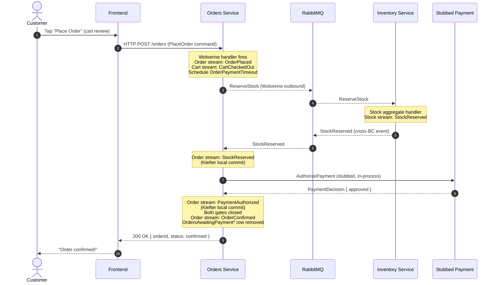

# Workshop 001 — CritterMart Round-One Rolled-Up Event Model

## 1. Scope

**In scope.** A single rolled-up Event Modeling artifact covering the four bounded contexts named in `docs/vision.md`: Catalog (deployed, document store), Inventory (deployed, event-sourced), Orders (deployed, event-sourced, contains Cart and Order aggregates), and Identity (stubbed for round one). The round-one slices covered are those implied by the vision's success criteria: catalog browse, cart manipulation with abandonment captured from day one, checkout and order placement, cross-BC stock reservation and stubbed payment authorization, order completion or timeout-driven cancellation, and the one async-projection teaser called for by ADR 008. The Place Order journey is the centerpiece and is rendered as a full storyboard for the OpenTelemetry trace demo (ADR 005).

**Deferred to the parking lot.** Long-road items from the vision — promotions, returns, marketplace listings, vendor portal, real payment integration, Polecat-backed Identity, broader async projection use, BFF. These appear as one-line entries in Section 9 only.

**Domain Storytelling was skipped** per `CLAUDE.md` § 2 and the routing of `docs/vision.md` § "Bounded contexts": CritterMart's single-seller domain has unambiguous shared vocabulary across the four BCs. Phase 1's brain dump proceeded directly.

---

## 2. Bounded-Context Summary

### Catalog (deployed; Marten document store)

The "when CRUD is fine" example. Persistence is the Marten document store; there is no event-sourced aggregate. The `Product` document is the model. Catalog has no BC-level integration with Orders or Inventory in round one (per the context map): product information flows through the frontend, which reads Catalog over HTTP and snapshots the relevant product fields into Cart commands at add-to-cart time. The "events" in Catalog are *lifecycle moments* — published-product, price-changed — captured for audit, not for state reconstruction. They are first-class in this workshop but produce no projections downstream other than the Catalog's own list/detail views.

Primary events: `ProductPublished`, `ProductPriceChanged`. (Optional: `ProductDiscontinued`, parked.)

### Inventory (deployed; event-sourced)

The textbook event-sourcing case. The `Stock` aggregate is keyed per SKU; the stream records physical and reservation lifecycle. Inline snapshot projections feed a `StockLevelView` read model used by Orders' process manager indirectly (Orders never reads the view, but the projection drives Inventory's own internal decisions). Inventory is the supplier in the Orders ↔ Inventory Customer-Supplier relationship from the context map.

Primary events on the Stock stream: `StockReceived`, `StockReserved`, `StockReleased`. (Out-of-stream message: `StockReservationFailed` is an outbound Wolverine message back to Orders but is *not* persisted on the Stock stream — there's no state change to record. Orders captures it on its own stream as a Klefter translation-decision event.)

### Orders (deployed; event-sourced)

Two event-sourced aggregates live here:

- **Cart aggregate.** Holds the customer's selection prior to checkout. Lifecycle: `CartCreated` → `CartItemAdded`/`CartItemRemoved`/`CartItemQuantityChanged` → either `CartCheckedOut` (terminal-success) or `CartAbandoned` (terminal-abandonment via Bruun temporal automation).
- **Order aggregate.** Acts as its own process manager per the Process Manager via Handlers pattern from ADR 007 — there is no separate saga state stream and no `Wolverine.Saga` base class. State flags on the Order stream (`StockReserved`, `PaymentAuthorized`) track progress through the two gates; terminal events (`OrderConfirmed`, `OrderCancelled`) close the stream. A scheduled `OrderPaymentTimeout` self-message is idempotent against the stream state.

Order-stream events include the four load-bearing names from ADR 007 (`StockReserved`, `PaymentAuthorized`, `OrderConfirmed`, `OrderCancelled`) plus `OrderPlaced`, `StockReservationFailed`, and `PaymentAuthFailed`. The last three are Klefter translation-decision events: they capture decisions made elsewhere (Inventory's refusal, the stubbed provider's response) as first-class events on the Order's own stream, providing the audit trail the BC needs to reason about its own history.

### Identity (stubbed for round one)

Per ADR 009 and the context map, Identity is not a deployed service in round one. A customer identifier is hardcoded into the frontend and flows through commands as if it came from a real identity system. The three deployed services accept the customer-ID shape without translation (Conformist relationship). No events, no streams, no projections in this context.

---

## 3. Timeline / Storyboard — Place Order Journey

This is the centerpiece. The talk's OpenTelemetry trace demo (per ADR 005) walks this sequence; all spans listed below are visible in the Aspire dashboard.

**Storyboard interpretation:**

- **UI moments.** Two screens flank the timeline: the cart review (Customer taps "Place Order") on the left, and the confirmation screen (or status-pending screen) on the right. Between them, all activity is system-driven and not directly visible to the customer beyond a status indicator.
- **Commands.** Two commands enter the system from outside: `PlaceOrder` from the frontend, and `ReserveStock` from Orders to Inventory (cross-BC). Both are Wolverine messages; `ReserveStock` rides over RabbitMQ per ADR 003.
- **Klefter local commits.** Three events on the Order stream are Klefter translation-decision events: `StockReserved`, `PaymentAuthorized` (and on the failure branches, `StockReservationFailed` and `PaymentAuthFailed`). Each one records an external decision as a first-class fact on the Order's own stream.
- **OTel spans.** The trace covers: HTTP POST `/orders` on the Orders side; Wolverine handler invocation; Marten event-append (per ADR 005, Marten's `TrackLevel.Verbose` instrumentation); outbound message produce span; broker span; inbound message handler on Inventory; Marten event-append on Inventory; outbound message produce span; broker span; inbound message handler back on Orders; Marten event-appends for the Klefter events; final HTTP response. The cross-service span chain is exactly what the talk demonstrates.

**Storyboards for BC-internal flows** (Cart manipulation, Catalog browsing, stock receipt) are intentionally not drawn as full sequence diagrams here. They are simpler `UI → Command → Event → View` shapes captured in the slice table (Section 6) and GWT scenarios (Section 7). The Place Order storyboard above is the only one that earns a full sequence diagram because it's the only flow that crosses BCs.

---

## 4. Event Vocabulary

Alphabetical within each BC. Past tense, no `Event` suffix, domain-meaningful. This list is the authoritative naming source for downstream OpenSpec proposals, narratives, and code.

### Catalog

- **ProductPriceChanged** — a product's listed price was changed. Lifecycle audit moment; not state-reconstruction.
- **ProductPublished** — a product is now visible in the catalog. Lifecycle audit moment.

### Inventory

- **StockReceived** — physical stock was added to inventory for a SKU.
- **StockReleased** — previously-reserved stock was returned to available capacity (typically as a compensation for `OrderCancelled`).
- **StockReserved** — stock was reserved against a specific order. State change on the Stock stream; also published cross-BC and consumed by Orders into its own stream as a Klefter local commit.

### Orders — Cart aggregate

- **CartAbandoned** — a cart was determined to have been abandoned via Bruun temporal automation (no further activity by the scheduled deadline). Terminal for the Cart stream.
- **CartCheckedOut** — a cart was checked out into an order. Terminal-success for the Cart stream; paired with `OrderPlaced` on the Order stream.
- **CartCreated** — a new cart was started for a customer (first item added).
- **CartItemAdded** — an item was added to a cart.
- **CartItemQuantityChanged** — the quantity of an existing line item changed.
- **CartItemRemoved** — an item was removed from a cart.

### Orders — Order aggregate

- **OrderCancelled** — terminal: the order was cancelled. Carries a reason payload (`stock_unavailable`, `payment_declined`, `payment_timeout`). When non-empty stock reservation existed, this event is published cross-BC for Inventory to release stock.
- **OrderConfirmed** — terminal: both stock and payment gates closed; the order is committed.
- **OrderPlaced** — an order was placed; the process manager begins. Cart's `CartCheckedOut` is paired with this on the Cart stream.
- **PaymentAuthFailed** — Klefter local commit: Orders records the stubbed payment provider's refusal as a first-class event on the Order stream.
- **PaymentAuthorized** — Klefter local commit: Orders records the stubbed provider's authorization as a first-class event on the Order stream.
- **StockReservationFailed** — Klefter local commit: Orders records Inventory's refusal as a first-class event on the Order stream. Note: not on the Stock stream — Inventory's refusal is not a state change there.
- **StockReserved** — Klefter local commit: Orders records Inventory's grant of stock on the Order stream. Same name as the Stock-stream event; conceptually the same fact, persisted in both streams for their respective purposes.

### Self-scheduled messages (NOT events on any stream)

These are Wolverine messages a service sends to itself with a future delivery time. They are not appended to any stream — they trigger handlers that may then append events.

- **CartActivityTimeout** — scheduled when cart activity occurs; if no further activity by deadline, the handler emits `CartAbandoned` (Bruun temporal automation, slice 3.4).
- **OrderPaymentTimeout** — scheduled when `OrderPlaced`; if the Order stream is not terminal at deadline, the handler emits `OrderCancelled` with reason `payment_timeout` (Bruun temporal automation, slice 4.7; per ADR 007).

### Identity

No events. Identity is stubbed.

---

## 5. Slice Table

Per the skill's Structured Output Format, augmented with `Reads-from` and `Writes-to` columns per CLAUDE.md § 3. Slices that span BCs note the chain with `→` in the BC column. `*(query)*` denotes a read-only slice; `*(scheduled)*` denotes a clock-triggered slice; `*(system)*` denotes a slice triggered by an upstream event/command from inside the same service.

| #   | Slice                                              | Command                  | Events                                              | View                                          | BC                        | Reads-from                                 | Writes-to                                                                     | Priority |
| --- | -------------------------------------------------- | ------------------------ | --------------------------------------------------- | --------------------------------------------- | ------------------------- | ------------------------------------------ | ----------------------------------------------------------------------------- | -------- |
| 1.1 | Publish a product                                  | `PublishProduct`         | `ProductPublished`                                  | `ProductCatalogView`                          | Catalog                   | —                                          | Product document; `ProductCatalogView`                                        | P0       |
| 1.2 | Browse and view products                           | *(query)*                | —                                                   | `ProductCatalogView`                          | Catalog                   | `ProductCatalogView`                       | —                                                                             | P0       |
| 1.3 | Change a product's price                           | `ChangeProductPrice`     | `ProductPriceChanged`                               | `ProductCatalogView`                          | Catalog                   | Product document                           | Product document; `ProductCatalogView`                                        | P2       |
| 2.1 | Receive stock                                      | `ReceiveStock`           | `StockReceived`                                     | `StockLevelView`                              | Inventory                 | —                                          | Stock stream; `StockLevelView`                                                | P0       |
| 2.2 | Reserve stock for an order                         | `ReserveStock`           | `StockReserved` (or `StockReservationFailed` msg)   | `StockLevelView`                              | Orders → Inventory        | Stock stream                               | Stock stream (on grant); outbound msg to Orders; `StockLevelView`             | P0       |
| 2.3 | Release reserved stock on order cancellation       | *(system)* via `OrderCancelled` event from Orders | `StockReleased`            | `StockLevelView`                              | Orders → Inventory        | Stock stream                               | Stock stream; `StockLevelView`                                                | P0       |
| 3.1 | Add item to cart                                   | `AddToCart`              | `CartCreated` (first time), `CartItemAdded`         | `CartView`                                    | Orders                    | Cart stream                                | Cart stream; `CartView`; refresh `CartActivityTimeout`                        | P0       |
| 3.2 | Remove item from cart                              | `RemoveCartItem`         | `CartItemRemoved`                                   | `CartView`                                    | Orders                    | Cart stream                                | Cart stream; `CartView`; refresh `CartActivityTimeout`                        | P0       |
| 3.3 | Change cart item quantity                          | `ChangeCartItemQuantity` | `CartItemQuantityChanged`                           | `CartView`                                    | Orders                    | Cart stream                                | Cart stream; `CartView`; refresh `CartActivityTimeout`                        | P1       |
| 3.4 | Abandon cart on inactivity (Bruun pattern)         | *(scheduled)* `CartActivityTimeout` self-message | `CartAbandoned`           | `CartAbandonmentReport` (async — see §8)      | Orders                    | `CartsAwaitingActivity*`; Cart stream      | Cart stream; `CartsAwaitingActivity*` row removed; `CartAbandonmentReport`    | P1       |
| 4.1 | Place order from cart                              | `PlaceOrder`             | `OrderPlaced`; `CartCheckedOut`                     | `OrderStatusView` (awaiting confirmation)     | Orders                    | Cart stream; Catalog snapshot in command   | Order stream; Cart stream; `OrderStatusView`; `OrdersAwaitingPayment*` row added; `OrderPaymentTimeout` scheduled | P0       |
| 4.2 | Reserve stock cross-BC                             | *(system)* outbound `ReserveStock` to Inventory; consumes `StockReserved` or `StockReservationFailed` back | `StockReserved` (Klefter local commit) OR `StockReservationFailed` (Klefter local commit) | `OrderStatusView` | Orders ↔ Inventory | Order stream | Order stream; `OrderStatusView`                                          | P0       |
| 4.3 | Authorize payment (Klefter translation-decision)   | *(system)* outbound `AuthorizePayment` to stubbed provider | `PaymentAuthorized` (Klefter local commit) OR `PaymentAuthFailed` (Klefter local commit) | `OrderStatusView` | Orders | Order stream | Order stream; `OrderStatusView`                                                                                | P0       |
| 4.4 | Confirm order when both gates closed               | *(aggregate decision)* on stream state | `OrderConfirmed` | `OrderStatusView` (confirmed)                 | Orders                    | Order stream                               | Order stream; `OrderStatusView`; `OrdersAwaitingPayment*` row removed         | P0       |
| 4.5 | Cancel order on stock-reservation failure          | *(aggregate decision)* on `StockReservationFailed` | `OrderCancelled` (reason: `stock_unavailable`) | `OrderStatusView` (cancelled) | Orders | Order stream | Order stream; `OrderStatusView`; `OrdersAwaitingPayment*` row removed (no cross-BC release — no reservation existed) | P0       |
| 4.6 | Cancel order on payment-auth failure               | *(aggregate decision)* on `PaymentAuthFailed` | `OrderCancelled` (reason: `payment_declined`) | `OrderStatusView` (cancelled) | Orders → Inventory | Order stream | Order stream; `OrderStatusView`; `OrdersAwaitingPayment*` row removed; outbound `OrderCancelled` to Inventory | P0       |
| 4.7 | Cancel order on payment timeout (Bruun pattern)    | *(scheduled)* `OrderPaymentTimeout` self-message | `OrderCancelled` (reason: `payment_timeout`) | `OrderStatusView` (cancelled) | Orders → Inventory | Order stream; `OrdersAwaitingPayment*`     | Order stream; `OrderStatusView`; `OrdersAwaitingPayment*` row removed; outbound `OrderCancelled` to Inventory | P0       |

**Slice count by BC.** Catalog: 3 (1 P2). Inventory: 3. Orders Cart: 4. Orders Place Order journey: 7. Total: 17.

**Slice priority distribution.** P0: 14. P1: 2 (`ChangeCartItemQuantity` and `CartAbandoned`). P2: 1 (`ChangeProductPrice`).

**Pattern citations in the table.**

- Bruun temporal-automation pattern is cited on slice 3.4 (`CartAbandoned` via `CartsAwaitingActivity*`) and slice 4.7 (`OrderCancelled` via `OrdersAwaitingPayment*`). The asterisk suffix marks the todo-list projection as a Bruun temporal-automation source.
- Klefter translation-decision pattern is cited on slices 4.2, 4.3, 4.5, 4.6: any time Orders commits an external decision (Inventory's refusal, the stubbed provider's response) as a local event on its own stream.

---

## 6. GWT Scenarios

One subsection per slice. Happy paths first. Failure paths are explicit per CLAUDE.md § 3 and the prompt's required-failures list: `StockReservationFailed`, `OrderPaymentTimeout` ending in `OrderCancelled`, and cross-BC message-loss / duplicate-delivery handling.

The `Given` clauses reference events already on the relevant stream (preconditions). The `When` clauses name the command, message, or scheduled trigger. The `Then` clauses name the events produced and/or the view state.

### 1.1 Publish a product — `PublishProduct`

**Happy path.**
- **Given** no product exists with SKU `crit-001`.
- **When** the operator issues `PublishProduct { sku: "crit-001", name: "Cosmic Critter Plush", price: 24.99 }`.
- **Then** a `ProductPublished` lifecycle moment is recorded and the `ProductCatalogView` shows the new product.

**Failure path — duplicate publish.**
- **Given** a product with SKU `crit-001` already exists.
- **When** the operator issues `PublishProduct { sku: "crit-001", ... }` again.
- **Then** the command is rejected with `ProductAlreadyPublished` (no new lifecycle moment recorded; idempotent failure).

### 1.2 Browse and view products — *(query)*

**Happy path.**
- **Given** two products are published: `crit-001` and `crit-002`.
- **When** the customer requests `GET /products`.
- **Then** the `ProductCatalogView` returns both products with current price and description.

(No failure path; query slice.)

### 1.3 Change a product's price — `ChangeProductPrice`

**Happy path.**
- **Given** a product with SKU `crit-001` is published at price `24.99`.
- **When** the operator issues `ChangeProductPrice { sku: "crit-001", newPrice: 19.99 }`.
- **Then** a `ProductPriceChanged` lifecycle moment is recorded with the old price (`24.99`) and the new price (`19.99`), and the `ProductCatalogView` reflects `19.99`.

**Note.** This slice illustrates that even a document store benefits from capturing lifecycle moments as first-class events for audit, without going full event-sourced. The product document is the source of truth; the lifecycle moment is the audit trail.

### 2.1 Receive stock — `ReceiveStock`

**Happy path.**
- **Given** no stock stream exists for SKU `crit-001`.
- **When** the operator issues `ReceiveStock { sku: "crit-001", quantity: 100 }`.
- **Then** the Stock stream for `crit-001` records `StockReceived { quantity: 100 }`, and `StockLevelView` shows `available: 100, reserved: 0`.

**Happy path — receiving additional stock.**
- **Given** the Stock stream for `crit-001` records `StockReceived { quantity: 100 }` and `StockReserved { quantity: 30, orderId: "ord-A" }`.
- **When** the operator issues `ReceiveStock { sku: "crit-001", quantity: 50 }`.
- **Then** the Stock stream appends `StockReceived { quantity: 50 }`, and `StockLevelView` shows `available: 120, reserved: 30`.

### 2.2 Reserve stock for an order — `ReserveStock`

**Happy path.**
- **Given** the Stock stream for `crit-001` shows `available: 100, reserved: 0`.
- **When** Inventory receives `ReserveStock { orderId: "ord-A", sku: "crit-001", quantity: 2 }` over RabbitMQ.
- **Then** the Stock stream appends `StockReserved { orderId: "ord-A", quantity: 2 }`, `StockLevelView` shows `available: 98, reserved: 2`, and Inventory publishes a `StockReserved` event back to Orders.

**Failure path — insufficient stock.**
- **Given** the Stock stream for `crit-001` shows `available: 1, reserved: 0`.
- **When** Inventory receives `ReserveStock { orderId: "ord-B", sku: "crit-001", quantity: 2 }`.
- **Then** the Stock stream is **not** modified (no state change to record), and Inventory publishes a `StockReservationFailed { orderId: "ord-B", sku: "crit-001", reason: "insufficient" }` message back to Orders.

**Failure path — duplicate `ReserveStock` delivery (Architect's voice; Wolverine at-least-once).**
- **Given** the Stock stream for `crit-001` shows `available: 98, reserved: 2`, with the existing reservation belonging to `ord-A`.
- **When** Inventory receives `ReserveStock { orderId: "ord-A", sku: "crit-001", quantity: 2 }` a second time (network retry).
- **Then** the handler detects via state guard that a reservation for `ord-A` already exists, the Stock stream is **not** modified, and Inventory re-publishes `StockReserved { orderId: "ord-A", quantity: 2 }` back to Orders (or no-ops; either policy preserves correctness because Orders' state guard also catches the duplicate).

### 2.3 Release reserved stock on order cancellation — `OrderCancelled` event consumption

**Happy path.**
- **Given** the Stock stream for `crit-001` shows `available: 98, reserved: 2`, with reservation against `ord-A`.
- **When** Inventory receives an `OrderCancelled { orderId: "ord-A" }` event from Orders.
- **Then** the Stock stream appends `StockReleased { orderId: "ord-A", quantity: 2 }`, and `StockLevelView` shows `available: 100, reserved: 0`.

**Failure path — `OrderCancelled` arrives for an order with no reservation (timeout before grant).**
- **Given** the Stock stream for `crit-001` has no reservation against `ord-C` (the `ReserveStock` for `ord-C` has not yet been processed, or already failed).
- **When** Inventory receives `OrderCancelled { orderId: "ord-C" }`.
- **Then** the handler detects via state guard that no reservation exists for `ord-C`, the Stock stream is **not** modified, and the handler returns successfully (idempotent no-op).

**Failure path — duplicate `OrderCancelled` delivery.**
- **Given** the Stock stream for `crit-001` already records `StockReleased { orderId: "ord-A" }`.
- **When** Inventory receives a duplicate `OrderCancelled { orderId: "ord-A" }`.
- **Then** the handler detects via state guard that the reservation is already released, the Stock stream is **not** modified, and the handler returns successfully (idempotent no-op).

> **Amendment (v1.2, 2026-05-31 — realized in slices 4.6 + 2.3, PR #35).** As shipped, the cross-BC release does **not** ride the literal `OrderCancelled { orderId }` event written above. Orders translates its cancellation into a **`ReleaseStock { orderId, lines: [{ sku, quantity }] }`** published-language command (`CritterMart.Contracts`, ADR 014), symmetric with `ReserveStock`. Three reasons: Inventory's `StockLevelView.Reservations` stores only order-id strings, so it cannot look up SKUs/quantities from an order id alone (the same wall slice 4.2 hit, resolved the same way — lines ride the message); anti-corruption — Inventory's wire vocabulary stays about *stock*, not *orders*; and reserve/release symmetry. The *behavior* in the GWTs above is honored exactly — release per reserved SKU, idempotent no-op when no reservation is held — only the message name/shape differs. Read "Inventory receives `OrderCancelled { orderId }`" as "Inventory receives `ReleaseStock { orderId, lines }`" throughout this slice. Durable spec: `openspec/specs/stock-management/spec.md`; rationale: archived change `slice-4-6-cancel-on-payment-decline/design.md` Decision 1; see also `docs/narratives/004-customer-purchase.md` (Moment 5) and `docs/retrospectives/implementations/010-slice-4-6-cancel-on-payment-decline.md`.

### 3.1 Add item to cart — `AddToCart`

**Happy path — first item.**
- **Given** no open cart exists for `customer-X`.
- **When** the customer issues `AddToCart { customerId: "customer-X", sku: "crit-001", quantity: 1, productSnapshot: {...} }`.
- **Then** a new Cart stream is created — keyed by a generated `cartId`, with `customerId` riding as a field — recording `CartCreated { cartId, customerId: "customer-X" }` and `CartItemAdded { sku: "crit-001", quantity: 1, snapshot: {...} }`. `CartView` shows the one line. *(Cart-activity timeout scheduling is deferred to slice 3.4 — see the amendment note below and §8 item 1.)*

**Happy path — adding a second item to an existing cart.**
- **Given** the Cart stream shows `CartCreated`, `CartItemAdded { sku: "crit-001", quantity: 1 }`.
- **When** the customer issues `AddToCart { ..., sku: "crit-002", quantity: 3, ... }`.
- **Then** the customer's open cart is resolved by querying `CartView` on `customerId` (a partial-unique index scoped to `IsOpen` carts enforces one open cart per customer), and the Cart stream appends `CartItemAdded { sku: "crit-002", quantity: 3 }`. `CartView` shows two lines. *(The cancel-and-reschedule timeout behavior is deferred to slice 3.4 — see §8 item 1.)*

> **Amendment (v1.1, 2026-05-30 — realized in slice 3.1, PR #25).** The v1.0 wording above implied the Cart stream is keyed by `customerId`. As shipped, slice 3.1 keys the stream by a **generated `cartId`** (parallels the Order stream's `orderId`); `customerId` rides as a field on `CartCreated`, and the customer's single open cart is resolved by querying `CartView` on `customerId` behind a **partial-unique index** (`Predicate "(data ->> 'IsOpen')::boolean = true"`) that enforces one open cart per customer at the database. The **`CartActivityTimeout`** machinery (scheduling, refresh, cancel-and-reschedule) is **deferred to slice 3.4** — slice 3.1 ships no timeout. Durable spec: `openspec/specs/shopping-cart/spec.md`; see also `docs/narratives/004-customer-purchase.md` and `docs/retrospectives/implementations/006-slice-3-1-add-to-cart.md`.

### 3.2 Remove item from cart — `RemoveCartItem`

**Happy path.**
- **Given** the Cart stream contains `CartItemAdded { sku: "crit-001" }` and `CartItemAdded { sku: "crit-002" }`.
- **When** the customer issues `RemoveCartItem { sku: "crit-001" }`.
- **Then** the Cart stream appends `CartItemRemoved { sku: "crit-001" }`. `CartView` shows only `crit-002`.

**Failure path — remove an item not in cart.**
- **Given** the Cart stream contains only `CartItemAdded { sku: "crit-002" }`.
- **When** the customer issues `RemoveCartItem { sku: "crit-001" }`.
- **Then** the command is rejected with `CartItemNotPresent` (no event appended).

### 3.3 Change cart item quantity — `ChangeCartItemQuantity`

**Happy path.**
- **Given** the Cart stream contains `CartItemAdded { sku: "crit-001", quantity: 1 }`.
- **When** the customer issues `ChangeCartItemQuantity { sku: "crit-001", newQuantity: 3 }`.
- **Then** the Cart stream appends `CartItemQuantityChanged { sku: "crit-001", quantity: 3 }`. `CartView` shows `crit-001` with quantity 3.

**Failure path — non-positive quantity.**
- **Given** any cart state.
- **When** the customer issues `ChangeCartItemQuantity { sku: "crit-001", newQuantity: 0 }`.
- **Then** the command is rejected (use `RemoveCartItem` for zero); no event appended.

### 3.4 Abandon cart on inactivity (Bruun temporal automation)

**Happy path.**
- **Given** the Cart stream for `customer-X` shows `CartCreated` and `CartItemAdded`, with a scheduled `CartActivityTimeout` whose deadline has been reached, and no further cart activity has occurred.
- **When** the `CartActivityTimeout` self-message fires.
- **Then** the handler reads the Cart stream, confirms no activity past the snapshot time, and appends `CartAbandoned { reason: "inactivity_timeout" }`. The `CartsAwaitingActivity*` row for `customer-X` is removed. The `CartAbandonmentReport` async projection (see §8) eventually reflects the abandonment.

**Failure path — cart activity intervened (state guard prevents premature abandonment).**
- **Given** a scheduled `CartActivityTimeout` for `customer-X`, and the Cart stream shows a `CartItemAdded` event with a timestamp *after* the timeout was scheduled.
- **When** the scheduled `CartActivityTimeout` fires.
- **Then** the handler detects activity past the scheduled time, no `CartAbandoned` event is appended, and a new `CartActivityTimeout` is rescheduled. Idempotent no-op via state guard.

**Failure path — duplicate `CartActivityTimeout` delivery.**
- **Given** a Cart stream that already has `CartAbandoned` appended.
- **When** a duplicate `CartActivityTimeout` arrives.
- **Then** the handler detects the cart is in a terminal state, no events appended (idempotent no-op).

### 4.1 Place order from cart — `PlaceOrder`

**Happy path.**
- **Given** the Cart stream for `customer-X` contains `CartCreated` and `CartItemAdded { sku: "crit-001", quantity: 2, snapshot: {...} }`.
- **When** the customer issues `PlaceOrder { customerId: "customer-X" }`.
- **Then** a new Order stream is created (stream id matches new `orderId`) and appends `OrderPlaced { orderId, customerId, items: [...], total: ... }`; the Cart stream appends `CartCheckedOut { orderId }`. `OrderStatusView` shows status `awaiting_confirmation`. A row is added to `OrdersAwaitingPayment*` for the new `orderId`. An `OrderPaymentTimeout` self-message is scheduled for the order's deadline.

**Failure path — empty cart.**
- **Given** the Cart stream for `customer-X` contains `CartCreated` but no `CartItemAdded` (or all items removed).
- **When** the customer issues `PlaceOrder`.
- **Then** the command is rejected with `CartEmpty`; no Order stream is created.

**Failure path — cart already checked out.**
- **Given** the Cart stream for `customer-X` already shows `CartCheckedOut`.
- **When** the customer issues `PlaceOrder` again (e.g., duplicate browser submission).
- **Then** the command is rejected (idempotent failure); no new Order stream.

### 4.2 Reserve stock cross-BC — *(system)*

**Happy path.**
- **Given** the Order stream shows `OrderPlaced { orderId, items: [{sku: "crit-001", quantity: 2}] }`.
- **When** Orders processes `OrderPlaced` and sends `ReserveStock` to Inventory over RabbitMQ; Inventory grants the reservation and publishes `StockReserved { orderId }` back to Orders.
- **Then** the Order stream appends `StockReserved { orderId }` (Klefter local commit). `OrderStatusView` shows status `stock_reserved`.

**Failure path — Inventory refuses (insufficient stock).**
- **Given** the Order stream shows `OrderPlaced`.
- **When** Inventory responds with `StockReservationFailed { orderId, reason: "insufficient" }`.
- **Then** the Order stream appends `StockReservationFailed { orderId, reason: "insufficient" }` (Klefter local commit). This is the precondition for slice 4.5.

**Failure path — `StockReserved` arrives after Order is already cancelled (Architect's voice).**
- **Given** the Order stream shows `OrderPlaced`, `OrderCancelled { reason: "payment_timeout" }` (terminal state).
- **When** a delayed `StockReserved { orderId }` arrives from Inventory.
- **Then** the Order stream state guard detects the order is terminal, no event is appended on the Order stream. (Slice 2.3's `OrderCancelled` handling on Inventory will have already released, or will release, the stock — see the next failure scenario.)

### 4.3 Authorize payment (Klefter translation-decision) — *(system)*

**Happy path.**
- **Given** the Order stream shows `OrderPlaced` and `StockReserved`.
- **When** Orders calls the stubbed payment provider with `AuthorizePayment { orderId, amount }` and receives a successful response.
- **Then** the Order stream appends `PaymentAuthorized { orderId, authCode: "stub-...", amount }` (Klefter local commit). `OrderStatusView` shows status `payment_authorized`.

**Failure path — provider declines.**
- **Given** the Order stream shows `OrderPlaced` and `StockReserved`.
- **When** Orders calls the stubbed provider and receives a declined response.
- **Then** the Order stream appends `PaymentAuthFailed { orderId, reason: "declined" }` (Klefter local commit). This is the precondition for slice 4.6.

**Note.** The provider response is **never** read again outside Orders. The Klefter local-commit event is the source of truth for the decision; the provider's transient response is not. This is the audit trail principle of the Klefter pattern.

### 4.4 Confirm order when both gates closed — *(aggregate decision)*

**Happy path.**
- **Given** the Order stream shows `OrderPlaced`, `StockReserved`, and `PaymentAuthorized`.
- **When** the aggregate decision logic runs after `PaymentAuthorized` is appended (or after `StockReserved` if it arrives second).
- **Then** the Order stream appends `OrderConfirmed { orderId }`. `OrderStatusView` shows status `confirmed`. The `OrdersAwaitingPayment*` row for `orderId` is removed.

**No failure path.** This slice is a pure aggregate decision: the inputs (`StockReserved` and `PaymentAuthorized` both present, no terminal event) deterministically produce `OrderConfirmed`. Any failure already prevented this slice from firing (slices 4.5, 4.6, 4.7 are the failure paths).

### 4.5 Cancel order on stock-reservation failure — *(aggregate decision)*

**Happy path (cancellation is the happy path here).**
- **Given** the Order stream shows `OrderPlaced` and `StockReservationFailed { reason: "insufficient" }`.
- **When** the aggregate decision logic runs after `StockReservationFailed` is appended.
- **Then** the Order stream appends `OrderCancelled { reason: "stock_unavailable" }`. `OrderStatusView` shows status `cancelled`. The `OrdersAwaitingPayment*` row for `orderId` is removed. **No** outbound `OrderCancelled` to Inventory — no reservation existed to release. (See open question §9 on whether we still publish the cross-BC event for symmetry.)

### 4.6 Cancel order on payment-auth failure — *(aggregate decision)*

**Happy path.**
- **Given** the Order stream shows `OrderPlaced`, `StockReserved`, and `PaymentAuthFailed { reason: "declined" }`.
- **When** the aggregate decision logic runs after `PaymentAuthFailed` is appended.
- **Then** the Order stream appends `OrderCancelled { reason: "payment_declined" }`. `OrderStatusView` shows status `cancelled`. The `OrdersAwaitingPayment*` row is removed. Orders publishes `OrderCancelled { orderId }` to Inventory over RabbitMQ. Inventory's slice 2.3 then appends `StockReleased`.

> **Amendment (v1.2, 2026-05-31 — realized in slice 4.6, PR #35).** As shipped, "Orders publishes `OrderCancelled { orderId }` to Inventory" reads as "Orders cascades **`ReleaseStock { orderId, lines }`** to Inventory" — see the § 2.3 amendment above for the full rationale (published-language command per ADR 014, not the Orders-internal event). Everything else shipped as written: `PaymentAuthFailed` and `OrderCancelled { reason: "payment_declined" }` land in one commit, `OrderStatusView` settles on `cancelled`, and Inventory releases the reservation. Durable spec: `openspec/specs/order-lifecycle/spec.md`. *(The `OrdersAwaitingPayment*` row-removal clause is deferred with the projection itself to slice 4.7 — that projection does not exist yet; same deferral as slice 4.1's row-added clause.)*

### 4.7 Cancel order on payment timeout (Bruun temporal automation) — *(scheduled)* `OrderPaymentTimeout`

**Happy path (cancellation is the happy path).**
- **Given** the Order stream shows `OrderPlaced` and `StockReserved`. The scheduled `OrderPaymentTimeout` deadline has been reached. `PaymentAuthorized` is **not** present.
- **When** the `OrderPaymentTimeout` self-message fires.
- **Then** the handler's state guard checks: is the order terminal? No. Is `PaymentAuthorized` present? No. Append `OrderCancelled { reason: "payment_timeout" }`. `OrderStatusView` shows status `cancelled`. The `OrdersAwaitingPayment*` row is removed. Orders publishes `OrderCancelled { orderId }` to Inventory; Inventory's slice 2.3 releases stock.

**Failure path — `PaymentAuthorized` raced in before the timeout fired.**
- **Given** the Order stream shows `OrderPlaced`, `StockReserved`, `PaymentAuthorized`, `OrderConfirmed` (terminal). The scheduled `OrderPaymentTimeout` for this order still exists in the queue.
- **When** the `OrderPaymentTimeout` self-message fires after `OrderConfirmed`.
- **Then** the handler's state guard detects the terminal state; no event appended; idempotent no-op.

**Failure path — duplicate `OrderPaymentTimeout` delivery.**
- **Given** the Order stream already shows `OrderCancelled { reason: "payment_timeout" }`.
- **When** a duplicate `OrderPaymentTimeout` arrives.
- **Then** the handler detects terminal state; no event appended; idempotent no-op.

**Failure path — `StockReserved` from Inventory arrives after `OrderCancelled` was emitted (delayed cross-BC).**

This is the cross-cutting race condition Architect's voice raised. It involves both Orders slice 4.2 and Inventory slice 2.3 working together:

- **Given** the Order stream shows `OrderPlaced`, `OrderCancelled { reason: "payment_timeout" }`. Inventory's Stock stream shows `StockReserved { orderId }` (granted, but the response was delayed crossing the broker).
- **When** Inventory receives the `OrderCancelled { orderId }` published by Orders' slice 4.7.
- **Then** Inventory's slice 2.3 handler appends `StockReleased { orderId }`; correctness is preserved — the reservation is released even though `OrderCancelled` arrived from a stream that never recorded the (delayed-arriving) `StockReserved`. Meanwhile, when the delayed `StockReserved` arrives at Orders, Orders' state guard ignores it (terminal state). Net result: Inventory's stock state is correct; Orders' stream is unchanged. Eventually-correct under at-least-once delivery.

> **Amendment (v1.3, 2026-06-01 — realized in slice 4.7, PR #37).** Two notes on how these scenarios shipped. **(1) Message shape:** every "Orders publishes `OrderCancelled { orderId }` to Inventory" above reads as "Orders cascades **`ReleaseStock { orderId, lines }`** to Inventory" — the same § 2.3/§ 4.6 amendment (v1.2) extended to this slice's scenarios, which were authored before that divergence was decided; same rationale (published-language command per ADR 014, Inventory needs the lines), no new decision. **(2) The release is unconditional:** as shipped, the timeout-cancel cascades `ReleaseStock` whether or not the Order stream records a `StockReserved` grant — the happy path's release and the delayed-grant failure path's release are the *same* unconditional cascade, with Inventory's per-SKU reservation guard (slice 2.3) deciding what is actually held. This is strictly stronger than the happy path's literal wording (which implies the release happens only when `StockReserved` is present) and is exactly what makes the delayed-grant scenario above work. Everything else shipped as modeled: the schedule lands at order placement (slice 4.1's writes-to clause, deferred to here), the terminal-state guard handles both no-op paths, and the `OrdersAwaitingPayment*` row add/remove clauses shipped with the projection (an inline single-stream projection with conditional deletes). Durable spec: `openspec/specs/order-lifecycle/spec.md` (requirements *Cancel an order on payment timeout* + *Track orders awaiting payment*).

---

## 7. Where the Async Projection Teaser Lands

Per ADR 008, one async projection lives in the codebase as a teaser for the "and you can also rebuild asynchronously" beat of the talk. The choice is **`CartAbandonmentReport`** — an analytics-grade read model fed by `CartAbandoned` events from the Cart stream.

**Why this projection.**

1. **Operationally tolerant of staleness.** `CartAbandonmentReport` is a marketing/analytics view, not a transactional read. Nothing on the hot path consumes it. Latency does not affect customer experience.
2. **Rebuild story has teeth.** The natural "what if we changed our minds" scenario is "we now count >24h as abandoned instead of >2h; recompute the historical report." That requires replaying `CartAbandoned` events (and possibly the cart activity events feeding the abandonment decision) into a new projection. The talk demonstrates this by rebuilding the projection from the event store.
3. **Distinguishes from inline siblings.** The inline-snapshot `CartsAwaitingActivity*` projection (which drives slice 3.4's temporal automation) is *not* the async one — it must be inline because automation depends on it. Having both an inline and an async projection over the same event stream illustrates that projection lifecycle is a per-projection choice, not a per-event choice. This is the pedagogical point that lands cleanest in the talk.

**Round-one constraint per ADR 008:** no async daemon is driven in the demo path. The `CartAbandonmentReport` projection's async lifecycle is configured, but the demo does not depend on it firing during a live walkthrough. A rebuild-on-demand demonstration is acceptable and is the talk's intended use.

**Not chosen — and why.**

- `OrdersAwaitingPayment*` — must be inline (drives `OrderPaymentTimeout` automation). Wrong choice.
- `StockLevelView` — must be inline (Orders' process manager indirectly depends on Inventory's reservation decisions being immediately consistent). Wrong choice.
- `OrderStatusView` — should be inline (customers see status immediately after `OrderConfirmed`/`OrderCancelled`). Wrong choice.
- A hypothetical `SalesByProductDaily` — would also work, but `CartAbandonmentReport` ties directly to vision.md's "cart abandonment events captured from day one" line and reinforces the Bruun pattern citation. Tighter pedagogical thread.

---

## 8. Open Questions / Parking Lot

Items the Architect, QA, Product Owner, and Domain Expert voices surfaced but did not fully resolve. Some become future ADRs; some become future workshops; some are explicit long-road deferrals from `docs/vision.md`.

### Open questions — round one

1. **Cart abandonment scheduling policy.** Cancel-and-reschedule on every cart activity vs. fire-and-check (fire on the original deadline, re-check stream timestamp, reschedule if activity intervened). Wolverine supports both. The slice 3.4 GWT scenarios assume cancel-and-reschedule, but the implementation can choose. Resolve in slice 3.4's OpenSpec proposal.
2. **Symmetric cross-BC `OrderCancelled` on stock-failure cancellation (slice 4.5).** Currently we *don't* publish `OrderCancelled` to Inventory when the cancellation is itself caused by stock refusal, because no reservation existed. But for symmetry and at-least-once safety against weird interleaving (Inventory granted stock and *then* refused a follow-on? Not possible in current model, but…), publishing the event anyway and letting Inventory's idempotent no-op handle it might be cleaner. Resolve in slice 4.5's OpenSpec proposal.
3. **`StockCommitted` event on the Stock stream when `OrderConfirmed` lands.** In current model, reserved stock simply *stays* reserved until released by `OrderCancelled` — there's no explicit "this reservation is now permanent" event. A `StockCommitted` event would close that loop and improve auditability. Deferred from round one to keep Inventory tight; flagged as a future-ADR candidate.
4. **Catalog → Orders price-change notifications.** Currently Catalog has zero BC-level outbound integration; the frontend snapshots prices at add-to-cart time. If a price changes between add-to-cart and place-order, the Cart's snapshot wins — by design. A future round could promote `ProductPriceChanged` to a cross-BC Published-Language event Orders subscribes to. Out of scope for round one.

### Long-road parking lot (from vision.md)

5. Polecat-backed deployed Identity service.
6. Returns BC (per context map § Long road).
7. Promotions BC with DCB-protected coupon redemption (per context map § Long road).
8. Real payment integration replacing the stubbed Klefter provider.
9. Async daemon and broader async projection coverage (round-one teaser is one projection only).
10. Separate BFF in front of the three Wolverine.Http surfaces.
11. Multi-channel / marketplace listings and vendor portal.
12. Configuration-as-Events for stock-reservation policy (Bruun adjunct pattern; the skill flags this as a plausible future candidate for an Inventory singleton stream).

### Methodology refinements (carry to retrospective)

13. The `Reads-from` / `Writes-to` columns added per CLAUDE.md § 3 are valuable for downstream OpenSpec authoring — they make explicit which streams and views a slice touches. This convention should be the default in future workshops. (Captured in retrospective.)
14. Citing Klefter and Bruun pattern names inline in the slice table (rather than in a separate "patterns" section) keeps the patterns visible at the slice level where the OpenSpec authoring will read them. Worth keeping.

---

## 9. Document History

| Version | Date       | Notes                                                                                                                                                                                                                                       |
| ------- | ---------- | ------------------------------------------------------------------------------------------------------------------------------------------------------------------------------------------------------------------------------------------- |
| v1.0    | 2026-05-26 | Initial commit. Round-one rolled-up model: four BCs, 17 slices, full Place Order storyboard, event vocabulary, GWT scenarios for all slices with required failure paths. `CartAbandonmentReport` selected as the round-one async projection teaser per ADR 008. |
| v1.1    | 2026-05-30 | `tidy: docs` amendment after slice 3.1 shipped (PR #25). Amended § 6.1 (slice 3.1 GWT): the Cart stream is keyed by a generated `cartId`, not `customerId` (which rides as a field on `CartCreated`); the open cart is resolved via a partial-unique `CartView` index on `customerId`. `CartActivityTimeout` scheduling/refresh deferred to slice 3.4 (none ships in 3.1). Realized in `openspec/specs/shopping-cart/spec.md` + retrospective 006. Slice table (§5) left at the model-level intent intentionally. |
| v1.2    | 2026-05-31 | `tidy: docs` amendment after slices 4.6 + 2.3 shipped (PR #35). Amended § 6 (slice 2.3 + 4.6 GWTs): the cross-BC release rides a `ReleaseStock { orderId, lines }` published-language command (`CritterMart.Contracts`, ADR 014), not the literal `OrderCancelled { orderId }` event — behavior honored exactly, message shape diverged (the same divergence kind 4.2 made for `ReserveStock`). Realized in `openspec/specs/order-lifecycle/spec.md` + `openspec/specs/stock-management/spec.md` + retrospective 010. Slice table (§5) left at the model-level intent intentionally. |
| v1.3    | 2026-06-01 | `tidy: docs` amendment after slice 4.7 shipped (PR #37). Amended § 6 (slice 4.7 GWTs): (1) extended the v1.2 `ReleaseStock` message-shape note to § 4.7's scenarios (authored before the v1.2 divergence was decided); (2) recorded that the timeout-cancel's release is **unconditional** — sent whether or not the Order stream records a grant, with Inventory's per-SKU guard deciding — which is what realizes the delayed-grant failure path. Schedule-at-placement, terminal guard, and `OrdersAwaitingPayment*` row add/remove all shipped as modeled. **The Order lifecycle (slices 4.1–4.7) is complete for round one.** Realized in `openspec/specs/order-lifecycle/spec.md` (8 requirements) + retrospective 011. Slice table (§5) left at the model-level intent intentionally. |
