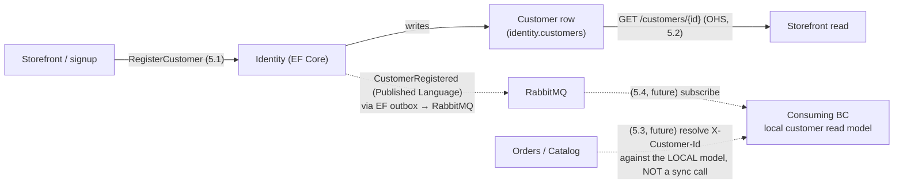

# Workshop 002 — CritterMart Identity Bounded Context (Spike Promotion)

## 1. Scope

**In scope.** The Identity bounded context, promoted from its round-one stub (a hardcoded frontend customer id, [ADR 009](../decisions/009-polecat-deferred-for-round-one.md)) to a kept, deployed service: a deliberately boring EF-Core customer registry. This workshop models that BC's event, command, read model, slices, and GWT scenarios, and names its strategic-design relationship to the other BCs (**Open-Host Service + Published Language**). The reference implementation is the spike on `spike/efcore-identity` (`0ffe42e`), which realizes slices 5.1 and 5.2.

**The spike inverted the pipeline — this workshop re-establishes the trace.** A spike is throwaway, so it legitimately built before any design artifact existed. Promotion re-asserts the discipline: this workshop is the design layer the kept code must trace back to, and the spike code re-lands on `main` later through an OpenSpec proposal → narrative → implementation prompt chain that references this model. This is also the **design-return interleave** the cadence rule had flagged as due.

**Identity stays a DATA STORE, not auth.** Per ADR 009, this promotion does NOT introduce Polecat, authentication, or authorization. Identity is a customer registry — a row per customer — nothing more. The round-one `X-Customer-Id` seam remains the identity transport; a future slice (5.3) resolves that header against this registry's published data.

**The teaching contrast.** Identity is the ONLY non-event-sourced BC. Where Catalog persists documents (+ lifecycle events) and Inventory/Orders persist event streams, Identity persists current state in a row. Its one "event," `CustomerRegistered`, is NOT a stream event and NOT the source of truth — it is an outbound integration notification published from a state change through the EF-Core transactional outbox. That is the workshop's pedagogical payoff: Event Modeling a CRUD/registry BC where the event is a published-language notification rather than the system of record, proving Wolverine's handler model (command → handler → outbound message, same transactional outbox) is persistence-agnostic.

**Deferred / future increments.** Slices 5.3 (resolve identity from `X-Customer-Id`) and 5.4 (a cross-BC consumer of `CustomerRegistered`) are modeled here but NOT built by the spike — they are the OHS/PL integration roadmap. Authentication, profile management beyond registration, and a Polecat backing remain long-road parking-lot items.

---

## 2. Bounded-Context Summary

### Identity (deployed — EF-Core customer registry; NOT event-sourced)

Identity is a deployed Wolverine service backed by Entity Framework Core (Npgsql) on the shared Postgres, in its own `identity` schema (schema-per-service, ADR 002). It is the sole non-event-sourced BC: the `Customer` row is the source of truth — no stream, no projection, no fold. A customer is created by `RegisterCustomer` and read by id. The service publishes `CustomerRegistered` to RabbitMQ through the EF-Core transactional outbox (the same outbox guarantee as the Marten services, a different store). It is an **Open-Host Service** — it exposes `GET /customers/{id}` for external (storefront) callers — and its `CustomerRegistered` event is a **Published Language** other BCs may subscribe to. It performs NO authentication or authorization (ADR 009); identity arrives ambiently on the `X-Customer-Id` seam.

---

## 3. Timeline / Flow

Identity has no multi-step journey of its own (contrast the Place Order storyboard in Workshop 001 § 3). Its flow is a single state change with two reader shapes:

Solid edges are realized by the spike (5.1 write, 5.2 read). Dashed edges are the OHS/PL integration roadmap (5.3/5.4) — declared but not yet trafficked.

**Architect note — the no-sync-HTTP constraint ([ADR 001](../decisions/001-separate-services-topology.md)).** The OHS read API (`GET /customers/{id}`) is for EXTERNAL callers — the storefront, exactly as it reads Catalog over HTTP. It is NOT how other services resolve identity: ADR 001/003 forbid synchronous service-to-service HTTP. A cross-BC consumer that needs customer data subscribes to the `CustomerRegistered` Published-Language event and maintains its own local read model (slice 5.4); slice 5.3's header resolution then reads that local model, never a sync call into Identity. This is the clean **OHS-for-the-frontend / PL-for-the-backends** split, and it is the load-bearing reconciliation of the owner's OHS+PL choice with ADR 001.

---

## 4. Event Vocabulary

### Identity

- **CustomerRegistered** — a customer was added to the registry. Published-Language integration event carrying `{ customerId, email, displayName }`, emitted from the `RegisterCustomer` state change via the EF-Core transactional outbox. It is NOT a stream event and NOT the source of truth — the `Customer` row is. It lives *inside* the Identity service today (nothing consumes it); it graduates to `CritterMart.Contracts` when slice 5.4 lands a consumer. (Future: **CustomerProfileUpdated**, when profile edits are modeled.)

Identity has no other events. It is a registry, not an event-sourced aggregate.

---

## 5. Slice Table

Columns per Workshop 001 § 5. `*(query)*` = read-only; `*(system)*` = triggered by an upstream event/command. The BC column reads `Identity → consumer` where a slice is Identity's contract but its code lands in a *consuming* BC.

| #   | Slice                                                | Command                          | Events                              | View / Read model                          | BC                  | Reads-from                                  | Writes-to                                                   | Priority          |
| --- | ---------------------------------------------------- | -------------------------------- | ----------------------------------- | ------------------------------------------ | ------------------- | ------------------------------------------- | ---------------------------------------------------------- | ----------------- |
| 5.1 | Register a customer                                  | `RegisterCustomer`               | `CustomerRegistered` (PL, outbox)   | `Customer` row                             | Identity            | `Customer` (duplicate-email guard)          | `Customer` row; `CustomerRegistered` (outbox → RabbitMQ)   | P0 (spike)        |
| 5.2 | Resolve a customer *(query)*                         | *(query)*                        | —                                   | `Customer` row                             | Identity            | `Customer` row                              | —                                                          | P0 (spike)        |
| 5.3 | Resolve identity from `X-Customer-Id` *(future)*     | *(system)* header → customer     | —                                   | consumer-local customer read model         | Identity → consumer | consumer-local model (from 5.4)             | —                                                          | P2 (future)       |
| 5.4 | Consume `CustomerRegistered` *(future, PL)*          | *(system)* via PL subscription   | — (consumer-local)                  | consumer-local customer read model         | Identity → consumer | `CustomerRegistered` (Published Language)   | consumer-local read model (upsert)                         | P2 (future)       |

**Slice count.** Identity: 4 — two realized by the spike (5.1 / 5.2), two future OHS/PL integration slices (5.3 / 5.4) whose code lands in consuming BCs.

**Pattern note.** No Klefter (translation-decision) or Bruun (temporal-automation) adjunct patterns apply — Identity has no external decisions to localize and no clocks. Its point of interest is the **persistence-agnostic transactional outbox**, not an adjunct event-modeling pattern.

---

## 6. GWT Scenarios

### 5.1 Register a customer — `RegisterCustomer`

**Happy path.**
- **Given** no customer exists for email `ada@example.com`.
- **When** the storefront issues `RegisterCustomer { email: "ada@example.com", displayName: "Ada Lovelace" }` at `POST /customers`.
- **Then** a `Customer` row is written (server-minted `id`, `registeredAt` = now), the response is `201 Created` with `Location: /customers/{id}`, and `CustomerRegistered { customerId, email, displayName }` is enrolled in the EF-Core outbox **in the same transaction** and published after the commit succeeds.

**Failure path — duplicate email (kept-service guard; NOT in the spike).**
- **Given** a customer already exists for email `ada@example.com`.
- **When** `RegisterCustomer { email: "ada@example.com", ... }` is issued again.
- **Then** the command is rejected with `CustomerAlreadyRegistered` — no row written, no event published, idempotent. **Note:** the spike performs no uniqueness guard (it inserts a new row every time); this is the first kept-service increment over the spike, to be specified in slice 5.1's OpenSpec proposal (including the uniqueness key).

### 5.2 Resolve a customer — *(query)*

**Happy path.**
- **Given** a customer `{ id: "c-1", email, displayName, registeredAt }` is registered.
- **When** the caller requests `GET /customers/c-1`.
- **Then** `200 OK` with `{ id, email, displayName, registeredAt }`.

**Failure path — unknown id.**
- **Given** no customer with id `nope`.
- **When** the caller requests `GET /customers/nope`.
- **Then** `404 Not Found`.

### 5.3 Resolve identity from `X-Customer-Id` — *(future, Open-Host Service)*

**Happy path (modeled, not built).**
- **Given** a consuming BC holds a local customer read model (populated by slice 5.4) including `c-1`.
- **When** a request arrives at that BC carrying `X-Customer-Id: c-1`.
- **Then** the consumer resolves `c-1` against its **local** model — never a synchronous call into Identity (ADR 001) — to enrich its behavior (e.g., the customer's display name on an order). If the local model lacks `c-1`, the consumer degrades gracefully (renders the id), since the PL event is eventually consistent.

### 5.4 Consume `CustomerRegistered` — *(future, Published Language)*

**Happy path (modeled, not built).**
- **Given** Identity publishes `CustomerRegistered { customerId: "c-1", email, displayName }`.
- **When** the consuming BC's subscriber handles it.
- **Then** the consumer upserts `c-1` into its local customer read model. `CustomerRegistered` moves to `CritterMart.Contracts` (Published Language) when this slice lands — until a consumer exists, keeping it Identity-local is correct (no premature shared contract).

---

## 7. Read Models / Projections

Identity has **none**. The `Customer` row IS the read model — there is no projection, no fold, no snapshot. This is the deliberate contrast with the event-sourced BCs (Workshop 001 § 7's async-projection teaser has no analogue here). The teaching point: when current-state CRUD is the right shape, you do not manufacture an event stream or a projection — you store the row and publish a notification. Identity is the **"when an event store would be over-engineering"** example, the counterpart to Catalog's **"when CRUD is fine"** document-store thread.

---

## 8. Open Questions / Parking Lot

### Open questions — the spike promotion

1. **Duplicate-email policy (slice 5.1).** The spike performs no uniqueness guard. A kept registry should reject a duplicate with `CustomerAlreadyRegistered` (modeled in 5.1's failure path). Resolve in slice 5.1's OpenSpec proposal — and decide the uniqueness key (email, or a separate natural key).
2. **When does `CustomerRegistered` move to `CritterMart.Contracts`?** It lives inside the Identity service today (unconsumed). It graduates to the shared Contracts assembly (Published Language) the moment slice 5.4 lands a consumer — not before.
3. **`X-Customer-Id` resolution mechanism (slice 5.3).** Confirmed: via the slice-5.4 local read model, NOT a sync HTTP call into Identity (ADR 001). The open sub-question is *which BC needs it first* (Orders, to put a customer name on `OrderStatusView`?) — that drives where 5.4's read model lives.
4. **Customer lifecycle beyond registration.** Profile edits (`CustomerProfileUpdated`), deactivation, and merge are unmodeled. A registry that only inserts is round-two-minimal; the lifecycle is a future increment.

### Long-road parking lot

5. **Polecat-backed authentication.** Identity-as-data-store (this BC) and Identity-as-auth-provider (Polecat) are **separate concerns**. This promotion is explicitly the former (ADR 009). A real auth lifecycle — credentials, sessions, claims — is a distinct future effort that could sit alongside or absorb this registry; it is NOT what slices 5.1–5.4 are.
6. **Self-service signup vs. admin-provisioned customers.** The spike's `RegisterCustomer` is open. Whether customers self-register (storefront signup) or are provisioned is a product question deferred past this pass.

---

## 9. Document History

| Version | Date       | Notes                                                                                                                                                                                                                                                                                                                                                                                       |
| ------- | ---------- | ------------------------------------------------------------------------------------------------------------------------------------------------------------------------------------------------------------------------------------------------------------------------------------------------------------------------------------------------------------------------------------------- |
| v1.0    | 2026-06-18 | Initial commit. Identity BC promoted from round-one stub to a kept EF-Core registry. Models 4 slices: **5.1 Register** / **5.2 Resolve** (realized by the spike on `spike/efcore-identity` @ `0ffe42e`); **5.3 Resolve from `X-Customer-Id`** / **5.4 Consume `CustomerRegistered`** (the future OHS/PL integration roadmap, modeled-not-built). Names the strategic-design relationship **Open-Host Service + Published Language** (context map amended in the same PR), with the OHS-for-frontend / PL-for-backends split reconciling the choice with ADR 001's no-sync-HTTP rule. Identity stays a **data store, not auth** (ADR 009). Authored as the design-return for the spike promotion; the spike code re-lands on `main` later via an OpenSpec proposal + narrative + implementation prompt that reference this model. |
