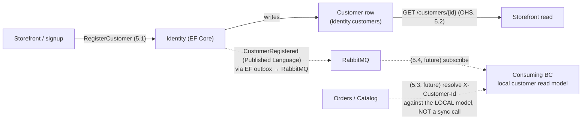

# Workshop 002 — CritterMart Identity Bounded Context (Spike Promotion)

## 1. Scope

**In scope.** The Identity bounded context, promoted from its round-one stub (a hardcoded frontend customer id, [ADR 009](../decisions/009-polecat-deferred-for-round-one.md)) to a kept, deployed service: a deliberately boring EF-Core customer registry. This workshop models that BC's event, command, read model, slices, and GWT scenarios, and names its strategic-design relationship to the other BCs (**Open-Host Service + Published Language**). The reference implementation is the spike on `spike/efcore-identity` (`0ffe42e`), which realizes slices 5.1 and 5.2.

**The spike inverted the pipeline — this workshop re-establishes the trace.** A spike is throwaway, so it legitimately built before any design artifact existed. Promotion re-asserts the discipline: this workshop is the design layer the kept code must trace back to, and the spike code re-lands on `main` later through an OpenSpec proposal → narrative → implementation prompt chain that references this model. This is also the **design-return interleave** the cadence rule had flagged as due.

**Identity stays a DATA STORE, not auth.** Per ADR 009, this promotion does NOT introduce Polecat, authentication, or authorization. Identity is a customer registry — a row per customer — nothing more. The round-one `X-Customer-Id` seam remains the identity transport; a future slice (5.3) resolves that header against this registry's published data.

**The teaching contrast.** Identity is the ONLY non-event-sourced BC. Where Catalog persists documents (+ lifecycle events) and Inventory/Orders persist event streams, Identity persists current state in a row. Its one "event," `CustomerRegistered`, is NOT a stream event and NOT the source of truth — it is an outbound integration notification published from a state change through the EF-Core transactional outbox. That is the workshop's pedagogical payoff: Event Modeling a CRUD/registry BC where the event is a published-language notification rather than the system of record, proving Wolverine's handler model (command → handler → outbound message, same transactional outbox) is persistence-agnostic.

**Deferred / future increments.** Slices 5.3 (resolve identity from `X-Customer-Id`) and 5.4 (a cross-BC consumer of `CustomerRegistered`) are modeled here but NOT built by the spike — they are the OHS/PL integration roadmap. Authentication, profile management beyond registration, and a Polecat backing remain long-road parking-lot items.

**v1.1 amendment — the `EmailChange` saga (Saga #2).** [ADR 009's second amendment](../decisions/009-polecat-deferred-for-round-one.md) settled that Identity's "deliberately boring CRUD" stance holds even as it grows a stateful consumer; [ADR 022](../decisions/022-convention-sagas-additive-to-pmvh.md) is the binding guard this amendment designs against — the saga does relational things the Wolverine way (a `DbSet`-mapped, string-keyed `Saga`-derived entity) and must not drift into re-implementing event sourcing on SQL. This amendment adds slices **5.5–5.7**: a customer requests an email change, has a confirm-or-expire window to confirm it, and the change applies or silently drops. It is the smallest honest multi-step workflow Identity has — a real confirm-or-expire window, unlike a name/address edit's single mutating command (see [`docs/research/wolverine-saga-feasibility.md`](../research/wolverine-saga-feasibility.md) § Candidate #2 — "don't invent a workflow" governs this amendment's scope). **Not yet implemented** — this workshop pass is the design-return that precedes the sibling OpenSpec proposal, narrative, and implementation prompt.

---

## 2. Bounded-Context Summary

### Identity (deployed — EF-Core customer registry; NOT event-sourced)

Identity is a deployed Wolverine service backed by Entity Framework Core (Npgsql) on the shared Postgres, in its own `identity` schema (schema-per-service, ADR 002). It is the sole non-event-sourced BC: the `Customer` row is the source of truth — no stream, no projection, no fold. A customer is created by `RegisterCustomer` and read by id. The service publishes `CustomerRegistered` to RabbitMQ through the EF-Core transactional outbox (the same outbox guarantee as the Marten services, a different store). It is an **Open-Host Service** — it exposes `GET /customers/{id}` for external (storefront) callers — and its `CustomerRegistered` event is a **Published Language** other BCs may subscribe to. It performs NO authentication or authorization (ADR 009); identity arrives ambiently on the `X-Customer-Id` seam.

**The EmailChange saga (v1.1, not yet implemented).** Slices 5.5–5.7 add an `EmailChange` saga keyed by `CustomerId`: a `RequestEmailChange` opens the saga (holding `PendingEmail`) and schedules an `EmailChangeTimeout`; a `ConfirmEmailChange` within the window applies the change to the `Customer` row; the timeout drops it if no confirmation arrives. This is Identity's **first stateful consumer** — CritterMart's *second* convention `Wolverine.Saga` (contrast Inventory's Marten-backed `Replenishment`, Workshop 001 slices 2.5–2.7) — proving the saga store itself is swappable (EF Core vs. Marten), per [ADR 022](../decisions/022-convention-sagas-additive-to-pmvh.md). The saga state lives in EF-Core saga storage (a `DbSet<EmailChange>` on `IdentityDbContext`), never on an event stream — Identity's registry framing is unchanged. See § 4's new saga-state subsection and slices 5.5–5.7 below.

---

## 3. Timeline / Flow

Identity has no multi-step journey of its own (contrast the Place Order storyboard in Workshop 001 § 3). Its flow is a single state change with two reader shapes:

Solid edges are realized by the spike (5.1 write, 5.2 read). Dashed edges are the OHS/PL integration roadmap (5.3/5.4) — declared but not yet trafficked.

**v1.1 note.** Slices 5.5–5.7 (the `EmailChange` saga) are a separate, additive flow off the `Customer` row — a request-then-confirm-or-expire window, not shown on the diagram above (which covers the registration/read flow only). See § 4's saga-state subsection below.

**Architect note — the no-sync-HTTP constraint ([ADR 001](../decisions/001-separate-services-topology.md)).** The OHS read API (`GET /customers/{id}`) is for EXTERNAL callers — the storefront, exactly as it reads Catalog over HTTP. It is NOT how other services resolve identity: ADR 001/003 forbid synchronous service-to-service HTTP. A cross-BC consumer that needs customer data subscribes to the `CustomerRegistered` Published-Language event and maintains its own local read model (slice 5.4); slice 5.3's header resolution then reads that local model, never a sync call into Identity. This is the clean **OHS-for-the-frontend / PL-for-the-backends** split, and it is the load-bearing reconciliation of the owner's OHS+PL choice with ADR 001.

---

## 4. Event Vocabulary

### Identity

- **CustomerRegistered** — a customer was added to the registry. Published-Language integration event carrying `{ customerId, email, displayName }`, emitted from the `RegisterCustomer` state change via the EF-Core transactional outbox. It is NOT a stream event and NOT the source of truth — the `Customer` row is. It lives *inside* the Identity service today (nothing consumes it); it graduates to `CritterMart.Contracts` when slice 5.4 lands a consumer. (Future: **CustomerProfileUpdated**, when profile edits are modeled.)

Identity has no other events. It is a registry, not an event-sourced aggregate.

### Saga state and saga messages (v1.1, NOT events on any stream)

The `EmailChange` saga (slices 5.5–5.7) introduces **saga state**, not stream events — Identity remains a registry with zero stream events regardless of this amendment. Per [ADR 022](../decisions/022-convention-sagas-additive-to-pmvh.md), this state is EF Core doing relational things the Wolverine way, the direct EF-Core-backed counterpart to Inventory's Marten-backed `Replenishment` saga (Workshop 001 § 4):

- **EmailChange** *(saga state, not a stream)* — one open instance per customer with a pending email change, keyed by `CustomerId`. Holds `PendingEmail` while the confirm-or-expire window is open. `MarkCompleted()` fires on a successful confirm (slice 5.6) or an unconfirmed timeout (slice 5.7).
- **RequestEmailChange** — command; opens the saga, or updates an already-open one's `PendingEmail` to the newest request (slice 5.5). The original `EmailChangeTimeout` is **not** rescheduled — Wolverine offers no scheduled-message cancellation, so a second timeout would either race the first or require tracking which one is authoritative. Mirroring `Replenishment`'s re-open branch (which schedules no second `ReplenishTimeout` for the identical reason), the confirm window is anchored to the *first* request in a re-request sequence, not the latest.
- **ConfirmEmailChange** — command; applies the pending email if the window is still open and the email hasn't since been claimed by another registration (`ux_customers_email`) (slice 5.6).
- **EmailChangeTimeout** — scheduled when the saga opens (config-driven duration — mirrors `ReplenishDeadline`'s config-singleton pattern, `src/CritterMart.Inventory/Stock/ReplenishDeadline.cs`); if unconfirmed by the deadline, drops the pending change and completes the saga (slice 5.7).

---

## 5. Slice Table

Columns per Workshop 001 § 5. `*(query)*` = read-only; `*(system)*` = triggered by an upstream event/command. The BC column reads `Identity → consumer` where a slice is Identity's contract but its code lands in a *consuming* BC.

| #   | Slice                                                | Command                          | Events                              | View / Read model                          | BC                  | Reads-from                                  | Writes-to                                                   | Priority          |
| --- | ---------------------------------------------------- | -------------------------------- | ----------------------------------- | ------------------------------------------ | ------------------- | ------------------------------------------- | ---------------------------------------------------------- | ----------------- |
| 5.1 | Register a customer                                  | `RegisterCustomer`               | `CustomerRegistered` (PL, outbox)   | `Customer` row                             | Identity            | `Customer` (duplicate-email guard)          | `Customer` row; `CustomerRegistered` (outbox → RabbitMQ)   | P0 (spike)        |
| 5.2 | Resolve a customer *(query)*                         | *(query)*                        | —                                   | `Customer` row                             | Identity            | `Customer` row                              | —                                                          | P0 (spike)        |
| 5.3 | Resolve identity from `X-Customer-Id` *(future)*     | *(system)* header → customer     | —                                   | consumer-local customer read model         | Identity → consumer | consumer-local model (from 5.4)             | —                                                          | P2 (future)       |
| 5.4 | Consume `CustomerRegistered` *(future, PL)*          | *(system)* via PL subscription   | — (consumer-local)                  | consumer-local customer read model         | Identity → consumer | `CustomerRegistered` (Published Language)   | consumer-local read model (upsert)                         | P2 (future)       |
| 5.5 | Request an email change *(saga)*                     | `RequestEmailChange`             | — *(opens `EmailChange` saga, or updates `PendingEmail` on an open one; no stream event, no row change yet)* | —                     | Identity            | `Customer` row exists for `CustomerId` (guard); email not already registered to another customer | `EmailChange` saga state (`PendingEmail`); `EmailChangeTimeout` scheduled **once, on open** — a re-request updates `PendingEmail` only, no second timeout | P1 (v1.1, not yet implemented) |
| 5.6 | Confirm an email change within the window *(saga)*   | `ConfirmEmailChange`             | — *(applies `Customer.Email`; completes `EmailChange` saga — no stream event, Identity is not event-sourced)* | `Customer` row (email) | Identity            | `EmailChange` saga state; `Customer` row (`ux_customers_email` recheck) | `Customer` row (`Email` updated); `EmailChange` saga `MarkCompleted` | P1 (v1.1, not yet implemented) |
| 5.7 | Drop an email change on timeout *(saga)*             | *(scheduled)* `EmailChangeTimeout` self-message | — *(completes `EmailChange` saga)* | —                     | Identity            | `EmailChange` saga state                    | `EmailChange` saga `MarkCompleted` (dropped, no row change) | P1 (v1.1, not yet implemented) |

**Slice count.** Identity: 7 — two realized by the spike (5.1 / 5.2), two future OHS/PL integration slices whose code lands in consuming BCs (5.3 / 5.4), three v1.1 `EmailChange` saga slices (5.5 / 5.6 / 5.7 — Saga #2, not yet implemented).

**Slice priority distribution.** P0: 2 (5.1, 5.2). P1: 3 (5.5, 5.6, 5.7 — the `EmailChange` saga). P2: 2 (5.3, 5.4 — future OHS/PL integration).

**Pattern note.** No Klefter (translation-decision) adjunct pattern applies — Identity has no external decision to localize. Bruun temporal-automation also does not apply to the `EmailChange` saga: `EmailChangeTimeout` is convention-saga machinery (a `TimeoutMessage` advancing *saga* state, exactly like Inventory's `ReplenishTimeout`), not a todo-list-projection self-message advancing a *stream* (contrast Bruun's `CartActivityTimeout` / `OrderPaymentTimeout` in Workshop 001). The convention **Wolverine Saga** pattern is cited on slices 5.5–5.7 via the `*(saga)*` marker — CritterMart's *second* use of the `Wolverine.Saga` base class (per [ADR 022](../decisions/022-convention-sagas-additive-to-pmvh.md)), EF-Core-backed in contrast to Inventory's Marten-backed `Replenishment`. Registration/read (5.1–5.4) still turn on the **persistence-agnostic transactional outbox**, unaffected by this amendment.

---

## 6. GWT Scenarios

### 5.1 Register a customer — `RegisterCustomer`

**Happy path.**
- **Given** no customer exists for email `ada@example.com`.
- **When** the storefront issues `RegisterCustomer { email: "ada@example.com", displayName: "Ada Lovelace" }` at `POST /customers`.
- **Then** a `Customer` row is written (server-minted `id`, `registeredAt` = now), the response is `201 Created` with `Location: /customers/{id}`, and `CustomerRegistered { customerId, email, displayName }` is enrolled in the EF-Core outbox **in the same transaction** and published after the commit succeeds.

**Failure path — duplicate email (kept-service guard; NOT in the spike).**
- **Given** a customer already exists for email `ada@example.com`.
- **When** `RegisterCustomer { email: "ada@example.com", ... }` is issued again.
- **Then** the command is rejected with `CustomerAlreadyRegistered` — no row written, no event published, idempotent. **Note:** the spike performs no uniqueness guard (it inserts a new row every time); this is the first kept-service increment over the spike, to be specified in slice 5.1's OpenSpec proposal (including the uniqueness key).

### 5.2 Resolve a customer — *(query)*

**Happy path.**
- **Given** a customer `{ id: "c-1", email, displayName, registeredAt }` is registered.
- **When** the caller requests `GET /customers/c-1`.
- **Then** `200 OK` with `{ id, email, displayName, registeredAt }`.

**Failure path — unknown id.**
- **Given** no customer with id `nope`.
- **When** the caller requests `GET /customers/nope`.
- **Then** `404 Not Found`.

### 5.3 Resolve identity from `X-Customer-Id` — *(future, Open-Host Service)*

**Happy path (modeled, not built).**
- **Given** a consuming BC holds a local customer read model (populated by slice 5.4) including `c-1`.
- **When** a request arrives at that BC carrying `X-Customer-Id: c-1`.
- **Then** the consumer resolves `c-1` against its **local** model — never a synchronous call into Identity (ADR 001) — to enrich its behavior (e.g., the customer's display name on an order). If the local model lacks `c-1`, the consumer degrades gracefully (renders the id), since the PL event is eventually consistent.

### 5.4 Consume `CustomerRegistered` — *(future, Published Language)*

**Happy path (modeled, not built).**
- **Given** Identity publishes `CustomerRegistered { customerId: "c-1", email, displayName }`.
- **When** the consuming BC's subscriber handles it.
- **Then** the consumer upserts `c-1` into its local customer read model. `CustomerRegistered` moves to `CritterMart.Contracts` (Published Language) when this slice lands — until a consumer exists, keeping it Identity-local is correct (no premature shared contract).

### 5.5 Request an email change — `RequestEmailChange` *(saga, v1.1)*

**Happy path.**
- **Given** customer `c-1` is registered with email `ada@example.com` and has no open `EmailChange` saga.
- **When** the storefront issues `RequestEmailChange { customerId: "c-1", newEmail: "ada.new@example.com" }`.
- **Then** an `EmailChange` saga opens (`Id = "c-1"`, `PendingEmail = "ada.new@example.com"`) and an `EmailChangeTimeout` is scheduled for the configured deadline. `Customer.Email` is **unchanged** until confirmation (slice 5.6).

**Failure path — new email already registered to another customer.**
- **Given** `taken@example.com` is already the registered email of customer `c-2`.
- **When** customer `c-1` issues `RequestEmailChange { customerId: "c-1", newEmail: "taken@example.com" }`.
- **Then** the command is rejected (`EmailAlreadyRegistered`, mirroring `RegisterCustomer`'s duplicate-email guard) — no saga opens, no timeout scheduled. This is an application-level check, racy on its own; the confirm-time recheck (slice 5.6) is the true backstop against a same-window race.

**Failure path — unknown customer.**
- **Given** no customer exists with id `ghost-1`.
- **When** `RequestEmailChange { customerId: "ghost-1", newEmail: "new@example.com" }` is issued.
- **Then** the command is rejected (`CustomerNotFound`) — no saga opens, no timeout scheduled. Without this guard, the illustrative saga shape (`wolverine-saga-feasibility.md` § Candidate #2) would open a saga for a customer that doesn't exist and null-reference at confirm time (`db.Customers.FindAsync(Id)` returning `null`).

**Edge path — re-request while a change is already pending.**
- **Given** customer `c-1` already has an open `EmailChange` saga with `PendingEmail = "ada.new@example.com"`, opened at `t0` with its `EmailChangeTimeout` still scheduled for `t0 + deadline`.
- **When** `c-1` issues a second `RequestEmailChange { customerId: "c-1", newEmail: "ada.newer@example.com" }` at `t1` (`t0 < t1 < t0 + deadline`).
- **Then** the existing saga's `PendingEmail` becomes `"ada.newer@example.com"` — but the **original** `EmailChangeTimeout` (still armed for `t0 + deadline`) is left in place, NOT rescheduled: Wolverine offers no scheduled-message cancellation, so a naive "schedule a fresh timeout on every re-request" design would leave the first timeout armed and firing early against the re-armed window. Net effect: the confirm window for a re-requested email is the *original* request's remaining time, not a full fresh window — mirroring `Replenishment`'s `StartOrHandle` re-open branch, which for the identical reason schedules no second `ReplenishTimeout` on re-open. The original pending email is abandoned without a trace beyond the saga's current state.

### 5.6 Confirm an email change within the window — `ConfirmEmailChange` *(saga, v1.1)*

**Happy path.**
- **Given** customer `c-1`'s `EmailChange` saga is open with `PendingEmail = "ada.new@example.com"` and the deadline has not passed.
- **When** `c-1` issues `ConfirmEmailChange { customerId: "c-1" }`.
- **Then** `Customer.Email` is set to `"ada.new@example.com"` (normalized, same as `RegisterCustomer`) and the `EmailChange` saga completes (`MarkCompleted()`, state deleted).

**Failure path — window already expired.**
- **Given** customer `c-1`'s `EmailChange` saga completed via timeout (slice 5.7) before confirmation arrived.
- **When** `ConfirmEmailChange { customerId: "c-1" }` arrives late.
- **Then** it is a silent no-op (`NotFound(ConfirmEmailChange)`, mirroring `Replenishment`'s `NotFound` statics) — Wolverine would otherwise throw on a non-start message for a missing saga. `Customer.Email` is unaffected.

**Failure path — pending email claimed by another registration during the window.**
- **Given** customer `c-1`'s `EmailChange` saga is open with `PendingEmail = "ada.new@example.com"`, and in the interim a different customer registered (or changed into) that same email, so `ux_customers_email` would reject the update.
- **When** `c-1` issues `ConfirmEmailChange { customerId: "c-1" }`.
- **Then** the command is rejected (`EmailChangeConflict`) and the saga stays **open** (no `MarkCompleted()`) — `c-1`'s only forward paths are letting the window expire (5.7 drops it) or issuing a fresh `RequestEmailChange` for a different email (5.5's re-request path re-arms the saga). No row change, no event.

### 5.7 Drop an email change on timeout — *(scheduled)* `EmailChangeTimeout` *(saga, v1.1)*

**Happy path.**
- **Given** customer `c-1`'s `EmailChange` saga is open with `PendingEmail = "ada.new@example.com"` and no `ConfirmEmailChange` arrived before the deadline.
- **When** the scheduled `EmailChangeTimeout` fires.
- **Then** the `EmailChange` saga completes (`MarkCompleted()`, state deleted) and `Customer.Email` is **unchanged** — the pending change is silently dropped. The customer may issue a fresh `RequestEmailChange` to try again (opens a new saga; slice 5.5).

**Failure path — timeout fires after the saga already completed via confirmation.**
- **Given** customer `c-1`'s `EmailChange` saga already completed (slice 5.6 confirmed within the window).
- **When** the previously-scheduled `EmailChangeTimeout` fires anyway (the runtime offers no scheduled-message cancellation, the same property Bruun slices 3.4/4.7 and Inventory's `Replenishment` rely on).
- **Then** it is a silent no-op (`NotFound(EmailChangeTimeout)`) — `Customer.Email` (already updated by the confirm) is unaffected.

---

## 7. Read Models / Projections

Identity has **none**. The `Customer` row IS the read model — there is no projection, no fold, no snapshot. This is the deliberate contrast with the event-sourced BCs (Workshop 001 § 7's async-projection teaser has no analogue here). The teaching point: when current-state CRUD is the right shape, you do not manufacture an event stream or a projection — you store the row and publish a notification. Identity is the **"when an event store would be over-engineering"** example, the counterpart to Catalog's **"when CRUD is fine"** document-store thread.

**v1.1 note — the `EmailChange` saga is not a customer-facing read model.** This still holds: the saga adds no new customer-facing view (no "email change pending" screen is modeled — the storefront simply awaits the confirm-or-timeout outcome). Its instance state (`PendingEmail`, whether open, the scheduled `EmailChangeTimeout`) IS, however, a **diagnostic/observability surface** — expected to appear on the CritterWatch console the same way Inventory's `Replenishment` saga does, now proven on a second backing store (EF Core). That is a live-verify concern, not a modeling one (§ 8, open question 10).

---

## 8. Open Questions / Parking Lot

### Open questions — the spike promotion

1. **Duplicate-email policy (slice 5.1).** The spike performs no uniqueness guard. A kept registry should reject a duplicate with `CustomerAlreadyRegistered` (modeled in 5.1's failure path). Resolve in slice 5.1's OpenSpec proposal — and decide the uniqueness key (email, or a separate natural key).
2. **When does `CustomerRegistered` move to `CritterMart.Contracts`?** It lives inside the Identity service today (unconsumed). It graduates to the shared Contracts assembly (Published Language) the moment slice 5.4 lands a consumer — not before.
3. **`X-Customer-Id` resolution mechanism (slice 5.3).** Confirmed: via the slice-5.4 local read model, NOT a sync HTTP call into Identity (ADR 001). The open sub-question is *which BC needs it first* (Orders, to put a customer name on `OrderStatusView`?) — that drives where 5.4's read model lives.
4. **Customer lifecycle beyond registration.** Profile edits (`CustomerProfileUpdated`), deactivation, and merge are unmodeled. A registry that only inserts is round-two-minimal; the lifecycle is a future increment. **v1.1 update:** email-change (5.5–5.7) is the first lifecycle increment past registration, and it earns a saga specifically because of the confirm-or-expire window — name/address edits remain a single mutating command (no saga) per the research's "don't invent a workflow" reasoning; they stay unmodeled until a real need surfaces.

### Open questions — the `EmailChange` saga (v1.1)

7. **Re-request behavior (slice 5.5).** Resolved (corrected during design review — the first draft had this wrong): a second `RequestEmailChange` while one is already pending updates `PendingEmail` to the latest request but does **not** reschedule `EmailChangeTimeout` — the *original* deadline governs the confirm window, exactly mirroring why `Replenishment`'s re-open branch schedules no second `ReplenishTimeout` (Wolverine has no scheduled-message cancellation; a second timeout would either fire early against the new window or require tracking which timeout is authoritative). It does not stack, queue, or reject the second request. Revisit only if a product reason to give a re-request its own full window surfaces (would require a generation marker on the saga so a stale timeout can no-op instead of firing).
8. **Confirm-time conflict handling (slice 5.6).** Resolved, closing the research's deferred question: a confirm that collides with `ux_customers_email` (another registration claimed the email during the open window) returns a conflict and does **not** complete the saga. The customer's only forward paths are a timeout-drop (5.7) or a fresh `RequestEmailChange` for a different email (re-arms per item 7).
9. **Future Published-Language notification for email changes.** Identity emits `CustomerRegistered` on registration but this amendment models no analogous `CustomerEmailChanged` notification for a successful confirm (5.6) — no consumer needs it yet (5.4's future local read-model doesn't currently carry email). Deferred, not built; follows the same "graduates to `CritterMart.Contracts` on first consumer" convention already set for `CustomerRegistered` if one emerges.
10. **CritterWatch saga-lifecycle payoff.** Confirms the feasibility note's open item #5: the `EmailChange` saga instance, its scheduled `EmailChangeTimeout`, and its completion are expected to surface on the CritterWatch console exactly as Inventory's `Replenishment` does — now proven on a *second* backing store (EF Core vs. Marten). Verified at live-verify time, not modeling time.

### Long-road parking lot

11. **Polecat-backed authentication.** Identity-as-data-store (this BC) and Identity-as-auth-provider (Polecat) are **separate concerns**. This promotion is explicitly the former (ADR 009). A real auth lifecycle — credentials, sessions, claims — is a distinct future effort that could sit alongside or absorb this registry; it is NOT what slices 5.1–5.7 are.
12. **Self-service signup vs. admin-provisioned customers.** The spike's `RegisterCustomer` is open. Whether customers self-register (storefront signup) or are provisioned is a product question deferred past this pass.

---

## 9. Document History

| Version | Date       | Notes                                                                                                                                                                                                                                                                                                                                                                                       |
| ------- | ---------- | ------------------------------------------------------------------------------------------------------------------------------------------------------------------------------------------------------------------------------------------------------------------------------------------------------------------------------------------------------------------------------------------- |
| v1.0    | 2026-06-18 | Initial commit. Identity BC promoted from round-one stub to a kept EF-Core registry. Models 4 slices: **5.1 Register** / **5.2 Resolve** (realized by the spike on `spike/efcore-identity` @ `0ffe42e`); **5.3 Resolve from `X-Customer-Id`** / **5.4 Consume `CustomerRegistered`** (the future OHS/PL integration roadmap, modeled-not-built). Names the strategic-design relationship **Open-Host Service + Published Language** (context map amended in the same PR), with the OHS-for-frontend / PL-for-backends split reconciling the choice with ADR 001's no-sync-HTTP rule. Identity stays a **data store, not auth** (ADR 009). Authored as the design-return for the spike promotion; the spike code re-lands on `main` later via an OpenSpec proposal + narrative + implementation prompt that reference this model. |
| v1.1    | 2026-07-02 | **Saga #2 forward increment** (not yet implemented) — adds the **`EmailChange` saga**, Identity's first stateful consumer and CritterMart's *second* convention `Wolverine.Saga` (EF-Core-backed, contrast Inventory's Marten-backed `Replenishment`). Added slices **5.5 request / 5.6 confirm / 5.7 timeout-drop** to § 5 (Identity 4→7, P1 0→3) with a new `*(saga)*` marker; § 1 and § 2 gain amendment summaries; § 4 gains a new **"Saga state and saga messages (NOT events on any stream)"** subsection (`EmailChange` saga, `RequestEmailChange`, `ConfirmEmailChange`, `EmailChangeTimeout`); § 6 gains GWT scenarios 5.5–5.7 (happy + failure/idempotency/conflict paths, plus an unknown-customer guard and a re-request edge path); § 7 notes the saga is a CritterWatch diagnostic surface, not a customer-facing read model; § 8 adds open questions 7–10 (re-request behavior, confirm-time conflict handling, future PL notification, CritterWatch payoff) and renumbers the parking lot to 11–12. Gated on [ADR 009's second amendment](../decisions/009-polecat-deferred-for-round-one.md) (boring-CRUD stance holds) and bound by [ADR 022](../decisions/022-convention-sagas-additive-to-pmvh.md) (relational-things-the-Wolverine-way guard). **Corrected during authoring, before this version was shared:** an independent design review (Fable 5, fresh-context) caught that the first draft's re-request path claimed to reschedule `EmailChangeTimeout` — but Wolverine has no scheduled-message cancellation, so the original timeout would still fire and drop the re-armed window early. Fixed to mirror `Replenishment`'s re-open branch exactly: a re-request updates `PendingEmail` only, the original deadline governs. The same review caught a missing existence guard on `RequestEmailChange` for an unknown `CustomerId` (now slice 5.5's second failure path) and flagged `docs/rules/structural-constraints.md` as stale against ADR 022 and ADR 009's amendment (fixed same-session, see that file's v1.7 entry). Authored as the design-return preceding the sibling OpenSpec proposal (`customer-registry` capability, per CLAUDE.md's one-capability-per-aggregate rule), narrative, and implementation — all consolidated into one PR per Erik's slice-PR preference ([[feedback-consolidate-slice-prs]]). Feasibility spike: `docs/research/wolverine-saga-feasibility.md` § Candidate #2. |
